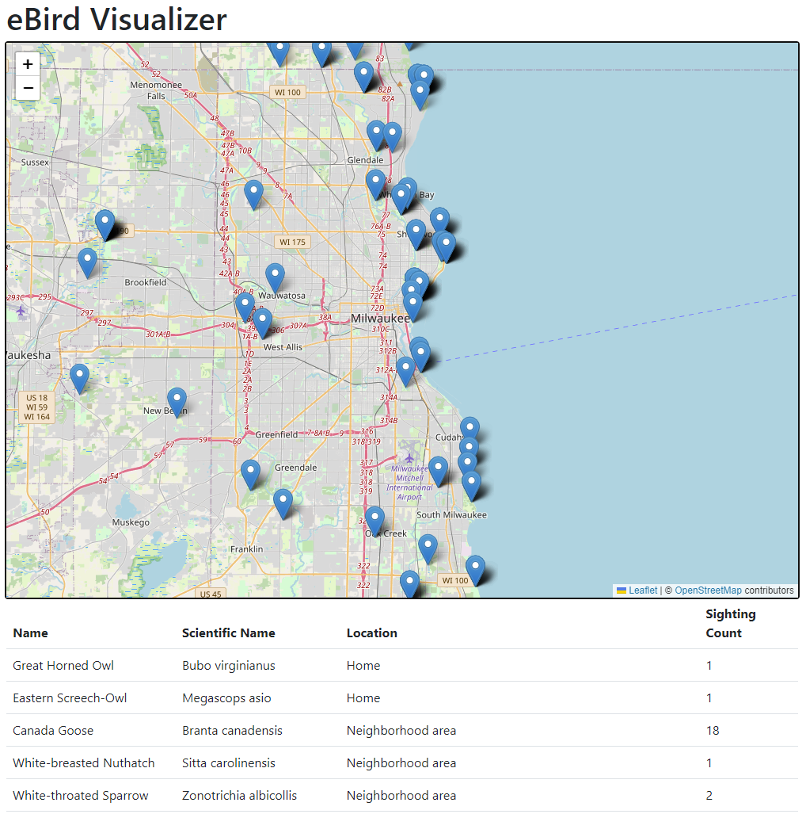
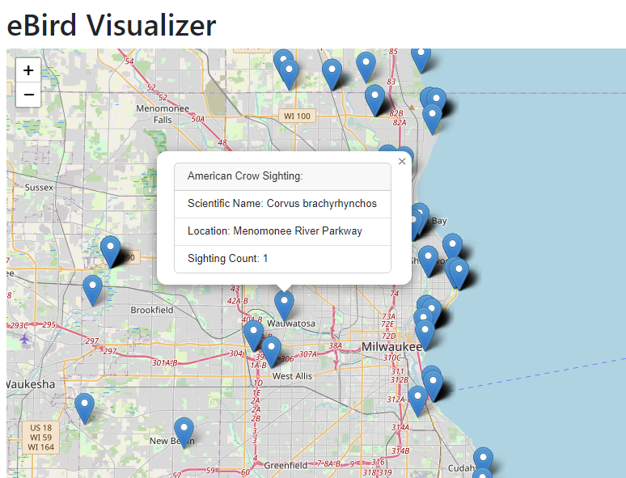
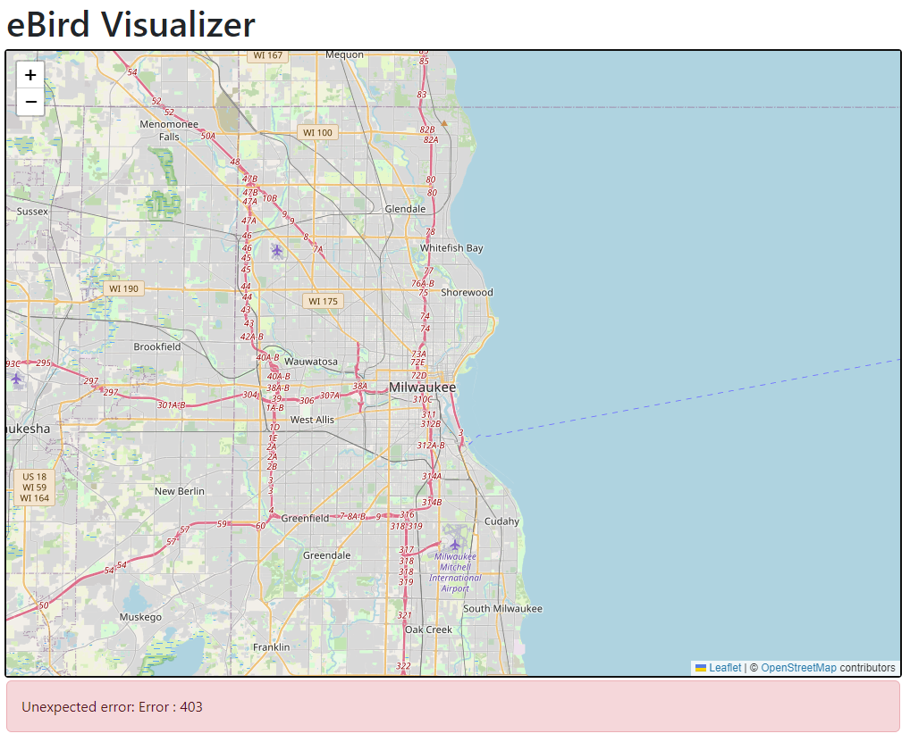
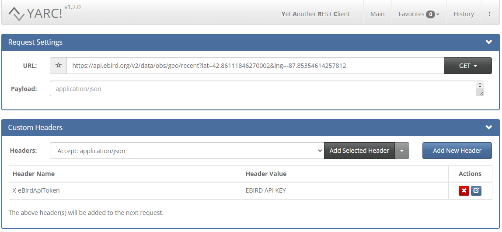

## Introduction

In this assignment, you will write a web application that uses asynchronous JavaScript requests to dynamically update a web application with data retrieved from a server.  You will also be using a 3rd party library to display retrieved data on a map.

Work on the assignment is to be done ***individually***.  You are welcome to collaborate with class members, but the project must be your own work.

## Background and References

### The Cornell Lab of Ornithology

The Cornell Lab of Ornithology maintains a database of bird species and bird sighting data across the word.  Researchers can use this data to monitor migration patterns, population data, etc.  You can submit your own bird sighting, download the raw data, or utilize their web tools through the eBird website: [https://ebird.org/](https://ebird.org/).

In addition, the eBird website hosts a web application programming interface (API) that can be used to retrieve information about bird sightings in an area.

### Leaflet

Leaflet ([https://leafletjs.com/](https://leafletjs.com/)) is a free JavaScript library for displaying and interacting with maps.  It lets you display a map at a particular location, add pinpoints, zoom in and out, etc.  However, as a user of the library you are required to provide your own map image.  For that, we will use OpenStreetMap ([https://www.openstreetmap.org/](https://www.openstreetmap.org/)) which is free open source map data.

### Resources

The following are some helpful resources:

- eBird API Documentation: [https://documenter.getpostman.com/view/664302/S1ENwy59](https://documenter.getpostman.com/view/664302/S1ENwy59)
- Leaflet API Documentation: [https://leafletjs.com/reference.html](https://leafletjs.com/reference.html)
- JavaScript Fetch API: [https://developer.mozilla.org/en-US/docs/Web/API/Fetch_API/Using_Fetch](https://developer.mozilla.org/en-US/docs/Web/API/Fetch_API/Using_Fetch)

***NOTE:*** for this assignment we will be using version 2.0 of the eBird API.

## Project Description

For this assignment, you will write a web application that shows the bird sightings near a location on a Leaflet map as well as in a table.  The location will be the center of the current "view" and will be retrieved through eBird API.

### Part 1: Creating your eBird API Key

To use the eBird API web service to retrieve data for the bird locations requires a free developer's license key.

Before starting the assignment you will need to create an account and request a key for the eBird web service:

- Create an account: [https://secure.birds.cornell.edu/cassso/account/create?service=https://ebird.org/login/cas?portal=ebird](https://secure.birds.cornell.edu/cassso/account/create?service=https://ebird.org/login/cas?portal=ebird)
- Login and generate an API key: [https://ebird.org/api/keygen](https://ebird.org/api/keygen)

You will need to copy and paste the key into your JavaScript code in order to use the API.

### Part 2: Become familiar with Leaflet

Leaflet ([https://leafletjs.com/](https://leafletjs.com/)) is a free JavaScript library for displaying and interacting with maps.  It lets you display a map at a particular location, add pinpoints, zoom in and out, etc.

In this section you will read through several tutorials for the Leaflet library.  The programming interface is not difficult, but takes some practice to get used to it.

Complete the following tutorials.  For each tutorial create a web application following the instructions.  Include the code you created as part of your submission.

- Leaflet Quick Start Guide - [https://leafletjs.com/examples/quick-start](https://leafletjs.com/examples/quick-start)
- Markers With Custom Icons - [https://leafletjs.com/examples/custom-icons](https://leafletjs.com/examples/custom-icons)

***NOTE:*** Some tutorials provide complete working solutions to the examples.  Feel free to use this code for reference but do not copy the code directly.  Your submission should be your own work.

### Part 3: The Bird Visualizer Application

For this assignment, you will create a web application that displays the location and information retrieved from the eBird API.  The application must consist of a map and a table.

The behavior of your bird visualizer map should be as follows:

- When the application loads, the user moves the center of the map view, or the user zooms in or out on the map, the application will request all, via the eBird API, recent bird sightings for the region centered at the map center.
- When the eBird API returns, the results should be shown on a map
   - Sighting locations should be shown as markers on the map
   - Old markers ***must*** be ***removed*** from the map, only the markers for the returned results should be displayed on the map.
- When the user clicks on the marker it should show, via a popup:
   - The common name for the bird
   - The scientific name for the bird
   - The location name of the sighting
   - The number of sightings in the region
   - ***HINT:*** [https://leafletjs.com/reference.html#popup](https://leafletjs.com/reference.html#popup)

***NOTE:*** You ***must*** use the eBird "Recent nearby observations" [https://documenter.getpostman.com/view/664302/S1ENwy59#62b5ffb3-006e-4e8a-8e50-21d90d036edc](https://documenter.getpostman.com/view/664302/S1ENwy59#62b5ffb3-006e-4e8a-8e50-21d90d036edc) API function for this assignment.

This function limits the results to a radius around a given latitude and longitude position.  The default is 25 kilometers.  You are free to use the default or set it ***larger***.  Do ***NOT*** use a smaller radius than the default.

***NOTE:*** The radius of the query for the API function might be less than the radius of the map zoom level.  As a result, you might notice a "cluster" of map markers in the middle of the map with none around it.  This is expected behavior.

The behavior of your bird visualizer table should be as follows:

- The table should be updated whenever the map is updated
- The table should display a row for each entry retrieved from the eBird API
- Table rows should show:
  - The common name for the sighted bird
  - The scientific name for the sighted bird
  - The location name for the sighted bird
  - The sighting count for the sighted bird
- ***NOTE:*** Table rows for previous sighting ***must*** be ***removed*** from the table.
- When the user clicks on a row in the table, the map must pan to the location.
  - ***HINT:*** [https://leafletjs.com/reference.html#map-panto](https://leafletjs.com/reference.html#map-panto)

When everything is working, your visualizer should look something like this:



When the user clicks on a marker, your visualizer should display a popup, something like this:



### Error Handling

If an error is returned from the eBird API:

- The map should be cleared of all markers
- The table should be cleared of all rows
- The error message should be displayed to the user

For example:



***NOTE:*** Error messages should ***NOT*** be displayed using ```window.alert```.  Consider using a Bootstrap alert: [https://getbootstrap.com/docs/5.3/components/alerts/](https://getbootstrap.com/docs/5.3/components/alerts/)

The user will have to change the zoom level or move the map center to a new location to start another query of the eBird API.

### Using a Google Table Chart

For this assignment, you are required to use a table to display the bird sighting data.  The Google charts library contains an object for 'charting' a table.  Instead of using an HTML table, you are welcome to use a [Google Table Chart](https://developers.google.com/chart/interactive/docs/gallery/table) provided all the requirements for the table are met.

## Getting Started

The following files have been provided for you in your repository:

- [BirdVisualizer.html](src/BirdVisualizer.html) - Web page HTML file (includes the imports for Bootstrap, Leaflet, and the BirdVisualizer CSS and JavaScript files)
- [BirdVisualizer.css](src/BirdVisualizer.css) - Initial styling to set up the sizes for the map
- [BirdVisualizer.js](src/BirdVisualizer.js) - JavaScript source file containing your event handlers and manipulation of the DOM

At the top of ***EACH SOURCE FILE*** include a comment block with your name, assignment name, and section number.

An initial staring location (the latitude and longitude of the MSOE athletic field) is provided for you in the [BirdVisualizer.js](src/BirdVisualizer.js).  Feel free to use this or another location as your map starting point.

The provided HTML is a starting point.  Feel free to modify the structure and styling as you like.  Just make sure your application meets the required functionality.

## Hints and Tips

### Setting your API key in a custom header

Your API key must be given to the eBird API in order to be authorized to retrieve the data.  The documentation requires the API be specified in a special HTTP header for your request.  You can specify custom headers in the ```fetch``` call.  For example:

```javascript
const eBirdKey = "EBIRD API KEY";
fetch("https://api.ebird.org/v2/data/obs/geo/recent?lat=42.86111846270002&lng=-87.85354614257812", {
   method: 'GET',
   headers: {
       'X-eBirdApiToken': eBirdKey
   },
});
```

***NOTE:*** You will have to replace "EBIRD API KEY" with your actual key.

### Getting the center of the map

The latitude and longitude values to use to query the eBird API must come from the center of the map's current view.  The ```getCenter()``` function on the Leaflet map ([https://leafletjs.com/reference.html#map-getcenter](https://leafletjs.com/reference.html#map-getcenter)) can be used to retrieve the center of the current map view.  This function returns a JavaScript object.  See the documentation for how to retrieve the latitude and longitude values from the object.

### Handling the eBird API data

On a successful return, the eBird API will return bird sighting data as a JSON encoded object consisting of an array of objects; one entry for each bird

```json
[
    {
        "speciesCode": "grhowl",
        "comName": "Great Horned Owl",
        "sciName": "Bubo virginianus",
        "locId": "L7234308",
        "locName": "Home",
        "obsDt": "2023-10-09 04:55",
        "howMany": 1,
        "lat": 43.2247704,
        "lng": -87.9334116,
        "obsValid": true,
        "obsReviewed": false,
        "locationPrivate": true,
        "subId": "S151780728"
    },
    {
        "speciesCode": "easowl1",
        "comName": "Eastern Screech-Owl",
        "sciName": "Megascops asio",
        "locId": "L7234308",
        "locName": "Home",
        "obsDt": "2023-10-09 04:30",
        "howMany": 1,
        "lat": 43.2247704,
        "lng": -87.9334116,
        "obsValid": true,
        "obsReviewed": false,
        "locationPrivate": true,
        "subId": "S151780717"
    },
    {
        "speciesCode": "cangoo",
        "comName": "Canada Goose",
        "sciName": "Branta canadensis",
        "locId": "L3358233",
        "locName": "Neighborhood area",
        "obsDt": "2023-10-08 18:25",
        "howMany": 18,
        "lat": 43.0212156,
        "lng": -88.0249393,
        "obsValid": true,
        "obsReviewed": false,
        "locationPrivate": true,
        "subId": "S151755150"
    },

    ... // etc.
]
```

The following will be helpful for determining bird data to display on the map and in the table.

| Table Value     | JSON Field Name |
|-----------------|-----------------|
| Name            | comName         |
| Scientific Name | sciName         |
| Location        | locName         |
| Sighting Count  | howMany         |

### Using the Fetch API

You will need to use the ```fetch``` JavaScript API to make your requests for the eBird data.  Remember that this API uses promises to perform the asynchronous request.  You are welcome to use the .```then/.catch``` interface or the ```async/await``` to manage the data.  Recall that the response from a fetch represents the HTTP response as a whole.  To get the JSON data from the body you will need to invoke the JSON API.  This is also asynchronous and returns a promise.

Furthermore, recall that the fetch API only throws an error when there is a connection problem with the server.  If it receives a response from the server, even if it is an error, then fetch will not reject the promise.  You will have to manually check the response status to detect an error.

For example if you have a function called ```updateMap``` that updates the map based on JSON data and a function called ```handleError``` for handling errors, then using the ```.then/.catch``` you might write something like:

```javascript
fetch(URL)
   .then((response) => {
       if(response.status !== 200) {
           throw new Error(String(response.status));
       }
       return response.json();
   })
   .then((responseJSON) => updateMap(responseJSON))
   .catch((error) => handleError(error));
```

Using ```async/await```, it might look like:

```javascript
try {
    const response = await fetch(URL);
    if(response.status !== 200) {
        handleError(String(response.status))
        return;
    } else {
        const responseJSON = await response.json();
        updateMap(responseJSON);
    }
} catch(error) {
    handleError(error);
}
```

However, these are just examples.  Feel free to implement your fetch request as works best for you.

## Testing and Debugging

### Testing your eBird API Key

It will be helpful to test if you your eBird API key is working correctly.  This can be difficult to test since the key must be specified in a ***custom header*** on the HTTP request.  When your browser makes an HTTP request (typed via the location bar), it doesn't allow for custom headers to be specified.  To send a custom request it is helpful to install and use a REST client.  There are several available for different browsers:
  
- Yet Another Rest Client (YARC) - [https://yet-another-rest-client.com/](https://yet-another-rest-client.com/) - Extension available for Chrome
- REST client by APIsHub - [https://apishub.com/](https://apishub.com/) - Extension available for Chrome and Firefox - [https://restclient.apishub.com/](https://restclient.apishub.com/)

When using YARC, you'll have to open up the "Custom Headers" section and add a header with the key ```X-eBirdApiToken``` and a value of your eBird API key.  For example, to use YARC to get all the bird sightings in the Milwaukee area using the URL: ```https://api.ebird.org/v2/data/obs/geo/recent?lat=42.86111846270002&lng=-87.85354614257812```



***NOTE:*** You'll need to replace ```EBIRD API KEY``` with your actual key.

## Deliverables

When you are ready to submit your assignment prepare your repository:

- Make sure your name, assignment name, and section number are in comments on ALL HTML, CSS, and JS file(s).
- Make sure your assignment code is commented thoroughly.
- Include in your submission, a set of suggestions for improvement and/or what you enjoyed about this assignment.
- Make sure all files are committed and pushed to the main branch of your repository.

***NOTE***: Do not forget to 'add', 'commit', and 'push' all new files and changes to your repository before submitting.

### Additional Submission Notes

If/when using resources from material outside what was presented in class (e.g., Google search, Stack Overflow, etc.) document the resource used in your submission.  Include exact URLs for web pages where appropriate.

NOTE: Sources that are not original research and/or unreliable sources are not to be used.  For example:

- Wikipedia is not a reliable source, nor does it present original research: [https://en.wikipedia.org/wiki/Wikipedia:Wikipedia_is_not_a_reliable_source](https://en.wikipedia.org/wiki/Wikipedia:Wikipedia_is_not_a_reliable_source)
- ChatGPT is not a reliable source: [https://thecodebytes.com/is-chatgpt-reliable-heres-why-its-not/](https://thecodebytes.com/is-chatgpt-reliable-heres-why-its-not/)

For more information, please see the [MSOE CS Code of Conduct](https://msoe.s3.amazonaws.com/files/resources/swecsc-computing-code-of-conduct.pdf).

To submit, copy the URL for your repository and submit the link to Canvas.

## Grading Criteria

- (5 Points) Submitted files follow submission guidelines
  - Only the requested files were submitted
  - Files are contain name, assignment, section
  - Sources outside of course material are cited
- (5 Points) Suggestions
  - List of suggestions for improvement and/or what you enjoyed about this assignment
- (10 Points) Code Structure
  - Readable code/file structure
  - Code is well documented
  - Code passes the HTML validator without errors
  - Code passes the CSS validator without errors
  - HTML only contains structure - no logic code or styling
- (20 Points) Completion of Leaflet Tutorial
- (45 Points) Functionality - Correct implementation of required functionality
  - Bird data is displayed on the map for location at the map center
    - When the page loads
    - When the user moves the map center (click and drag)
    - When the user changes the zoom level (in or out)
  - Bird sighting locations are correctly displayed in the map with markers
    - Map only contains markers for current view of bird results
  - Bird sighting markers have the correct popup values
  - Data is properly displayed in the table
  - Table is correctly labeled
  - Table data is correctly displayed
    - Table only contains rows for current view of bird results
  - Map correctly pans to the bird sighting location when the user clicks on a table row
    - ***NOTE:*** this causes a change in map center - data should be retrieved from eBird when this happens
- (15 Points) Error Checking
  - Errors are correctly handled and displayed to the user
  - Error message is displayed not using window.alert
  - Map is cleared of all markers when an error occurs
  - Table is cleared of all data when an error occurs
  - Error message is removed when there is no longer an error