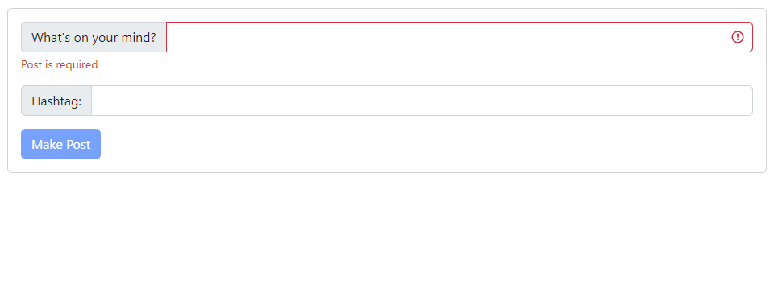
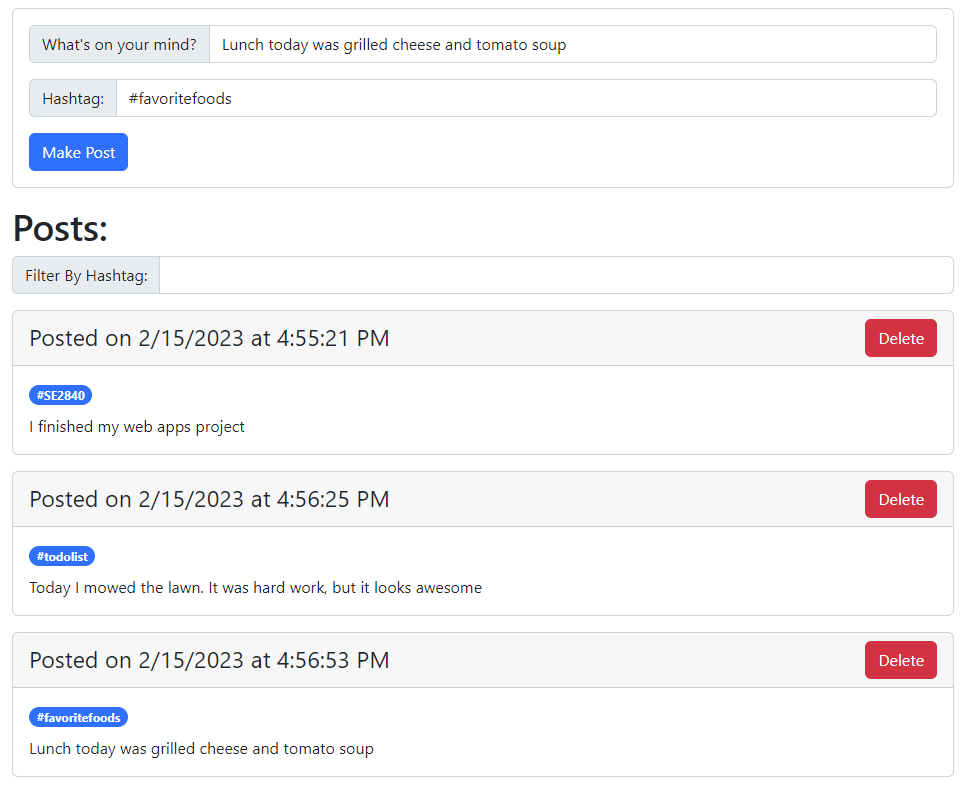
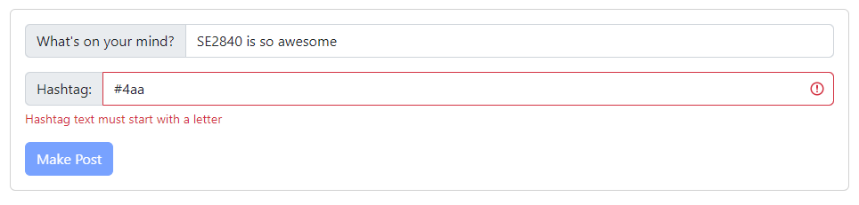
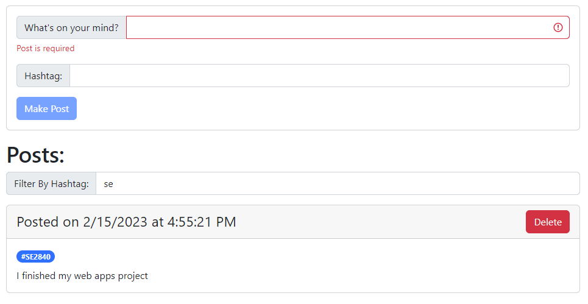

## Introduction

In this assignment, you will create both the front-end application and back-end server for an application to record and search for blog posts.

Work on the assignment is to be done ***individually***.  You are welcome to collaborate with class members, but the project must be your own work.

## Background and References

A [blog](https://en.wikipedia.org/wiki/Blog) (AKA web log) is an informational website designed to allow a user to post text information.  These posts are often in a diary style and/or an indication of what is on the creator's thoughts at the given time.

A [hashtag](https://en.wikipedia.org/wiki/Hashtag) is a classification symbol which allows blog posts to be labeled as a set type.  Users can use the hashtag for filtering blog posts to only those related to a specific interest.

In this assignment, web application will utilize these ideas to create a blog with hashtags.  The data will be stored by the web server using a MongoDB database.  Your server will host the files for the web application as well as host an application programming interface (API) to allow the client to retrieve, create, and delete blog posts. 

The following are some helpful resources:

- Express API Documentation: [https://expressjs.com/en/api.html](https://expressjs.com/en/api.html)
- Mongoose API Documentation: [https://mongoosejs.com/docs/guide.html](https://mongoosejs.com/docs/guide.html)

## Project Description

For this assignment, your job is to create a blogger application.  Your application must consist of several components:

A client user interface that must consist of the following:

- A set of inputs allowing the user to write a blog post and set an optional hashtag
- A display area showing the list of blog posts displayed sorted by the date of creation
- An input allowing a user to filter based on hashtag

A server that must consist of the following:

- Static hosting of the client application
- An API to create, retrieve, and delete blog post entries

### Development Requirements

#### Input Validation

You are required to validate input values and parameters on ***BOTH*** the client and the server.

Here are the user input fields on the client that must be validated.  These values will be sent to the server and must also be validated there.

- Blog Post (required)
  - The blog post must be text characters and must not be empty
- Hashtag (optional)
  - The hashtag is optional but if specified it must:
    - Start with a # character
    - Contain only letters and number after the # (capital or lower case are allowed)
    - Must start with a letter after the # (capital or lower case are allowed)
    - Additional information on [hashtag rules](https://www.hashtags.org/featured/what-characters-can-a-hashtag-include/)
  - ***NOTE:*** Only a ***single*** hashtag is allowed for each bog post

#### Server

The following are required of the server:

- Static hosting of the client application - This is already set up using express hosting the application from the ```public``` directory
- Endpoints for the blog API
- Endpoint parameter validation - See the input validation requirements
- Persistence of the blog posts in a MongoDB API using mongoose

#### Server Endpoint Requirements

Data Schema - Format for database document
- A blog post consists of the following data format
  - _id - identifier - A unique identifier for the post - this is generated by MongoDB automatically
  - post - String (required)
  - hashtag - String (optional)
  - creation_date - Date (required) - Computed using ```Date.now()```

***NOTE:*** the documents for the blog posts need to be stored in a database and a collection.
- The database ***must*** be called ```blog```
- The collection ***must*** be called ```posts```

***NOTE:*** the hashtag is an optional addition to a blog post and may not exist.  Your server must ***NOT*** store the hashtag in the database if it does not exist in the blog post.

##### GET /posts
- Retrieves the blog posts
- No required parameters

- Response Format:

  ```json
  {
     "status": "success",
     "posts": []
  }
  ```

  ```posts``` should be returned as a JSON string representing an array of blog post entries.  Each array entry must be formatted as described in the schema.

  ***NOTE:*** if the hashtag does not exist for a blog post, your server must ***NOT*** return the hashtag field in the entry for the blog post.

##### POST /post
- Creates and stores a new blog post in the database
- Two required parameters - specified as a ***JSON string*** in the ***body*** of the request
  - post - String (required)
  - hashtag - String (optional)
    - ***NOTE:*** the hashtag is optional - Your server must be able to handle:
      - When the hashtag is not specified in any parameter
      - The hashtag is specified, but the value is empty (null string)
      - A hashtag specified with the value ```undefined``` or ```null``` or null string is valid and should be treated as if the hashtag was not specified
- Response Format:

  ```json
  {
     "status": "success",
     "post": {}
  }
  ```

  ```post``` should be returned as a JSON string representing the created blog post entry formatted as described in the schema.

##### DELETE /post
- Deletes a blog post from the database by id
- One required parameter - specified as a ***query*** parameter
  - id - MongoDB id string
- Response Format:

  ```json
  {
     "status": "success",
     "post": {}
  }
  ```

  ```post``` should be returned as a JSON string representing the deleted blog post entry formatted as described in the schema.

#### Client User Interface

The following are required of the client user interface

##### Creating a blog post

  - Write a blog post
    - Must allow the user to enter the blog post as text
    - The input text must be validated - See input validation requirements
    - An error message must be displayed for invalid input
  - Write a hashtag
    - Must allow the user to enter the hashtag as text
    - The input text must be validated - See input validation requirements
    - An error message must be displayed for invalid input
  - Submitting a new blog post
    - A button or other submit interface causing the new blog post to be created
    - Invokes the server ```POST /post``` server end point to create the blog post entry
    - ***NOTE:*** The "Blog post display" should be updated to show the created blog post
    - Any error returned from the server should be displayed to the user if the blog post was not created.

##### Blog post display

  - The application should invoke the ```GET /posts``` server endpoint to retrieve all the blog post data
    - Blog posts must be displayed in the order in which they are created (most recent first)
    - Blog posts must show the date and time of creation along with the hashtag (if present) and the blog post text
    - If the hashtag is not specified, the client should not show any hashtag for the blog post.
    - ***NOTE:*** the hashtag is optional and hashtag field will ***NOT*** be given by the server if it does not exist.  Your client must be able to handle this.
  - Each blog post should include a delete button allowing the user to delete the blog post
    - The application should invoke the ```DELETE /post``` server endpoint to delete the blog post by its identifier.
    - NOTE: The "Blog post display" should be updated to show that the blog post has been removed
    - Any error returned from the server should be displayed to the user if the blog post was not deleted.
  - If there are no blog posts, the blog post display should be either hidden or disabled

##### Blog post filter

  - Must allow the user to enter a filter string as text
  - The user is not required to enter filter text, but if specified it must perform a case-insensitive substring search of the ***hashtag***.  The filter should ***NOT*** search the blog post text.
  - The filter ***must*** perform filtering in realtime as the user types
  - If a blog post has no hashtag it should be displayed only if the filter is blank
  - If there are no blog posts, the blog post filter should either be hidden or disabled
- Deleting a blog post:
  - Allows a user to delete an individual blog post
  - The application should invoke the ```DELETE /post``` server end point to delete the blog post
  - Upon successful return from the server, the blog post should be removed from the blog post display
- Script injection
  - A user should not be allowed to execute JavaScript through script injection via any input field
  - The data displayed from loaded blog posts/hashtags should not cause a script injection

Here is an example of an acceptable interface.  Your interface does not need to match this exactly, but must contain the necessary elements.  Be creative, adjust the formatting in a way that looks best to you.

Blogger with no blog posts:


Blogger with blog posts:


Example error for hashtag that is not valid:


Filtering blog posts by hashtag:


## Getting Started

The following files have been provided for you in your repository:

- [src/public/blogger.html](src/public/blogger.html) - HTML file containing imports and application structure.  You will need to update this file to include additional HTML elements as necessary.
- [src/public/blogger.js](src/public/blogger.js) - JavaScript file to contain user interface functionality (event handlers, etc.).
- [src/public/blogger.css](src/public/blogger.css) - CSS file for customer styling definitions.
- [src/public/utils.js](src/public//utils.js) - JavaScript file with a set of utility functions that may be useful for performing input validation
- [src/public/bloggerAPI.js](src/public//bloggerAPI.js) - JavaScript file containing function declarations for calls to server API endpoints.
- [blogserver.mjs](src/blogserver.mjs) - The Node.js server - provides static hosting of the application (stored in the ```public``` directory) and the endpoints for the blog API.
- [package.json](src/package.json) - NPM package file containing dependencies for the project

At the top of ***EACH EDITED SOURCE FILE*** include a comment block with your name, assignment name, and section number.

Before you start, you will need to install the application dependencies.  These dependencies are located in the ```package.json``` file within the ```src``` directory.

To install the dependencies, open a terminal and change to the ```src``` directory and run:

```text
npm install
```

This will install ```express```, ```mongoose```, and other dependencies needed for your project.

Feel free to add additional dependencies as needed, using ```npm install <PACKAGENAME>```.  Make sure you add, commit, and push your changes to the ```package.json``` if you add additional packages.

## Hints and Tips

### Using the Node.js Server instead of WebStorm

For previous projects, you were able to use the internal WebStorm web server to host your project.  This resulted in your browser accessing a web application at:

```text
http://localhost:63342/
````

However, for this project, the text file manager is hosted using the node.js server using the express package.  You will first need to run ```blogserver.mjs``` and then access the page using the following URL:

```text
http://localhost:3000/
```

### Setting the Request Method using ```fetch```

By default, the ```fetch``` API used for AJAX requests on the client creates a ```GET``` HTTP request.  For this assignment, you will need to also make requests that utilize other request methods.  This can be done by modifying the ```options``` parameter on the ```fetch``` API call.  For more information see: [https://developer.mozilla.org/en-US/docs/Web/API/fetch#method](https://developer.mozilla.org/en-US/docs/Web/API/fetch#method)

For example, to make a ```POST``` request:

```javascript
fetch(apiEntpoint, {
   method: 'POST'
});
```

### Setting the Request Body using ```fetch```

The server API for creating a blog post: ```POST /post``` requires that the data for the blog post (hashtag and blog post text) be placed in the ***body*** of the request in ***JSON*** data format.  This requires 2 steps:

1. To tell the server that the body contents is JSON data, the HTTP header for ```Content-type``` must be set to ```application/json```.  To set the content type requires setting the ```headers``` value in the ```options``` field of the ```fetch``` call.  For more information see: [https://developer.mozilla.org/en-US/docs/Web/API/fetch#headers](https://developer.mozilla.org/en-US/docs/Web/API/fetch#headers)
2. To set the body on ```fetch``` request requires modifying the ```options``` parameter on the ```fetch``` APi call.  For more information see: [https://developer.mozilla.org/en-US/docs/Web/API/fetch#body](https://developer.mozilla.org/en-US/docs/Web/API/fetch#body)

For example:

```javascript
fetch(apiEntpoint, {
   method: 'POST',
   headers: {
     'Content-Type': 'application/json'
   },
   body: post_data
});
```

***NOTE:*** ```post_data``` will need to be replaced with the correct values for the blog post data.

### Retrieving the Request Body on the Server

The client will be setting the content type header and the body of the ```POST /post``` endpoint to the data for the new blog post  The server will need to retrieve this data from the body in order to save the content to the database.   In client JavaScript, using the ```fetch``` API, the body can be retrieved as json using the ```response.json()``` function call.  However, in ```express```, this requires add different method.

To tell ```express``` to interpret the body as json requires the use of the ```json()``` middleware.  At the top of the ```blogserver.mjs``` you will notice a call to:

```javascript
// Use text middleware to interpret request body as JOSN
app.use(express.json());
```

Using this middleware, your server code can directly access the request body.  For example,

```javascript
const post_data = request.body;
```

This will set ```post_data``` equal to the JSON content of the request body.  Using the ```json()``` middleware, ```express``` will convert the JSON string to a JavaScript object for you, similar to the behavior of ```response.json()``` does for a JavaScript client application.

## Deliverables

When you are ready to submit your assignment prepare your repository:

- Make sure your name, assignment name, and section number are in comments on ALL HTML, CSS, and JS file(s) that you edited for this assignment.
- Make sure your assignment code is commented thoroughly.
- Include in your submission, a set of suggestions for improvement and/or what you enjoyed about this assignment.
- Make sure all files are committed and pushed to the main branch of your repository.

***NOTE***: Do not forget to 'add', 'commit', and 'push' all new files and changes to your repository before submitting.

### Additional Submission Notes

If/when using resources from material outside what was presented in class (e.g., Google search, Stack Overflow, etc.) document the resource used in your submission.  Include exact URLs for web pages where appropriate.

NOTE: Sources that are not original research and/or unreliable sources are not to be used.  For example:

- Wikipedia is not a reliable source, nor does it present original research: [https://en.wikipedia.org/wiki/Wikipedia:Wikipedia_is_not_a_reliable_source](https://en.wikipedia.org/wiki/Wikipedia:Wikipedia_is_not_a_reliable_source)
- ChatGPT is not a reliable source: [https://thecodebytes.com/is-chatgpt-reliable-heres-why-its-not/](https://thecodebytes.com/is-chatgpt-reliable-heres-why-its-not/)

For more information, please see the [MSOE CS Code of Conduct](https://msoe.s3.amazonaws.com/files/resources/swecsc-computing-code-of-conduct.pdf).

To submit, copy the URL for your repository and submit the link to Canvas.

## Grading Criteria

- (5 Points) Submitted files follow submission guidelines
  - Only the requested files were submitted
  - Files are contain name, assignment, section
  - Sources outside of course material are cited
- (5 Points) Suggestions
  - List of suggestions for improvement and/or what you enjoyed about this assignment
- (10 Points) Code Structure
  - Readable code/file structure
  - Code is well documented
  - Code passes the HTML validator without errors
  - Code passes the CSS validator without errors
  - HTML only contains structure - no logic code or styling
- (30 Points) Blog Server
  - Correct request types, parameters, and input data format
  - Correct server side response format
  - Correct server side error checking of query parameters and routes
  - Error messages returned by the server make sense
- (50 Points) Client side - Interface
  - Client code implements the required interface components
  - Required interface correctly performs required behavior
  - Interface and functionality correctly creates a post
  - Interface and functionality correctly deletes a post
  - Posts stored on the server are displayed when page loads
  - Posts display date and time of creation, hashtag, and text
  - Posts are sorted based on date created (most recent first)
  - Correct client side input validation
  - Correct display and clearing of server errors
  - Post Filter:
    - Filters on hashtag only
    - Filters using a case-insensitive substring
    - Filter is not displayed if there are no posts