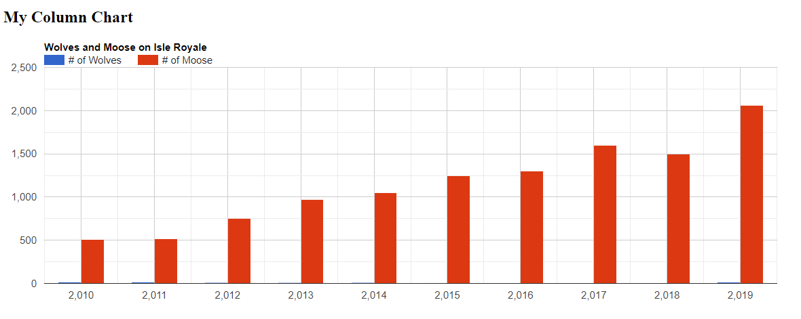
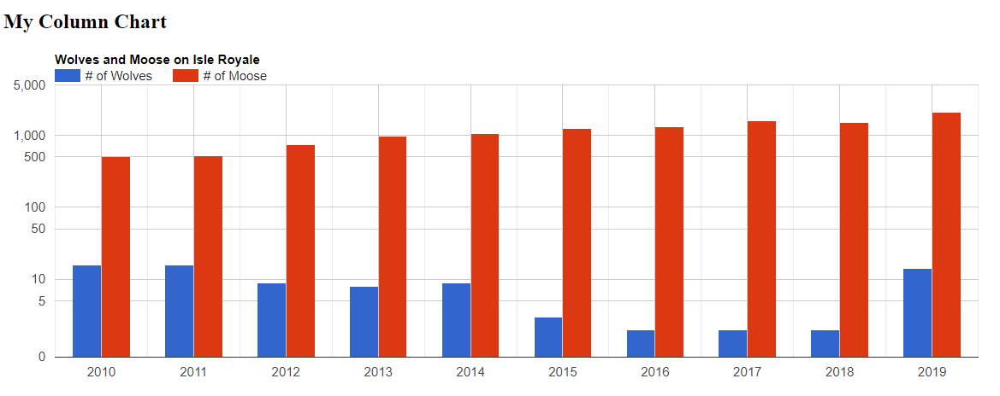

## Introduction

The purpose of this assignment is to guide you through the creation of charts using the Google Charts JavaScript library.

For this assignment, you may be asked to answer questions and/or write some code.  Provide complete answers to all written questions:  When asked for examples, be specific.  Submit your answers in a document separate from code.

Include source files for all programs in your submission.  Follow good styling for programming questions and provide complete documentation (comment blocks, inline comments for complicated code, etc.).

Work on the assignment is to be done with ***your assigned group***.  You are welcome to collaborate with class members, but the submitted assignment must be the work of only your group.

## Background

There are a lot of third party libraries provided by developers that allow us to focus our web applications on overall function and user experience rather than the detailed logic of how web application components work.  Graphical visualization is one such component that can help users 'see' data rather than just reading it from a table.

The Google Charts library is one such JavaScript library for charting data.  The library draws chart are drawn using Scalable Vector Graphics (SVG).  To use the library, it must be imported into your web application either from a direct download from Google or via content delivery network (CDN).

This assignment guides you through the setup, creation, and customization of a Google Column chart.

The library also supports several other char types.  For a complete list of all charts available through Google Charts: [https://developers.google.com/chart/interactive/docs](https://developers.google.com/chart/interactive/docs) 

## Installation and setup

The Google Charts library is used though Google's content delivery network (CDN).  A CDN is a way to provide external libraries to web applications without requiring the application to download and host the library itself.

Importing the Google charts library from their CDN requires adding a couple lines to our HTML header.  The following HTML imports the Google charts from the CDN.

```html
<!DOCTYPE html>
<html lang="en">
    <head>
        <meta charset="UTF-8">
        <title>Google Chart Exercise</title>

        <!-- Include the Google bar chart library -->
        <script type="text/javascript" src="https://www.gstatic.com/charts/loader.js"></script>
    </head>
</html>
```

## Additional Setup

To create a chart using the library we need to include some additional elements:

1. A script containing configuration of the library and the logic needed to create the chart
2. Additional HTML elements to use for the chart.

At the very minimum the Google Charts library requires a single ```<div>``` element with an identifier (id).  The library will create additional children of this element in the document to draw the chart SVG.

This can be done by creating a new JavaScript file (```mychart.js```) then adding the script using ```<script>``` to the 'index.html' in the ```<head>```.

```html
<script type="text/javascript" src="mychart.js"></script>
```

This code will act as the JavaScript 'controller' code for your chart.

Next, the ```<body>``` containing the ```<div>``` for the chart needs to be added to the 'index.html'.

```html
<body>
    <h2>My Column Chart</h2>
    <div id="chart_div"></div>
</body>
```

This will create a heading to label the chart and more importantly a ```<div>``` tag that the Google Chart library will use to display the chart.  Your JavaScript 'controller' code will tell the Google library which identifier (```id``` for the ```<div>``` tag) to use to draw the chart.  Without this, the Google chart library will not be able to create the chart.

The following files have been provided for you in your repository:

- [src/index.html](src/index.html) - HTML file that includes the import of the Google Charts library.  Use this as a starter for your forms page.  It also includes the necessary body to provide Google charts with the element to draw the chart.
- [src/mychart.js](src/mychart.js) - JavaScript file to use for the code to control the Google chart.

***NOTE:*** Include additional JS and CSS file(s) if needed.  At the top of ***EACH SOURCE FILE*** include a comment block with your name, assignment name, and section number.

## Loading the Chart Library 

The Google Charts library CDN only imports the 'loader' for the library itself.  Instead of including the all the code for the library, the loader contains functions available to load the library dynamically from Google.  To use the library functions, the code must first be loaded.  To load the Google Chart library function you use the following JavaScript:

```javascript
google.charts.load('current', {packages: ['corechart']});
```

This loads the 'current' version of the 'corechart' library which is what we need.  This load happens asynchronously which means that the 'load' function returns before the library functions are loaded.  In order to use the library you need to wait for the load to finish.  The Google loader notifies your code that the load has finished by using a callback function.  So, you'll need to make a callback function and tell that to Google chart loader.

To tell the Google chart loader to load the chart when your page loads and specify a callback function, use the following:

```javascript
const drawChart = () => {
    // TODO: add the code to draw the chart here
};

window.onload = () => {
    google.charts.load('current', {packages: ['corechart']});
    google.charts.setOnLoadCallback(drawChart);
};
```

***NOTE:*** Since Google Charts is an external library, WebStorm might give you some warnings about undefined values.  You can ignore them since the variables will be available when the library is loaded from Google.

More information on the Google Chart loading can be found in the Google Chart documentation: [https://developers.google.com/chart/interactive/docs/basic_load_libs](https://developers.google.com/chart/interactive/docs/basic_load_libs)

## Preparing the Chart Data

Google Charts requires all data to be contained with in a DataTable JavaScript object.  This object is similar to a database table.  In short, the table is a 2-dimensional array of elements where the elements themselves have a type and an optional label.

For example, let's use the population of wolves and moose on Isle Royal: [https://www.nps.gov/isro/learn/nature/wolf-moose-populations.htm](https://www.nps.gov/isro/learn/nature/wolf-moose-populations.htm) from 2010 to 2019.

| Year  | # of Wolves | # of Moose |
|:-----:|:-----------:|:----------:|
| 2010  |     19      |    510     |
| 2011  |     16      |    515     |
| 2012	 |      9      |    750     |
| 2013	 |      8      |    975     |
| 2014	 |      9      |    1050    |
| 2015  |     	3      |    1250    |
| 2016  |      2      |    1300    |
| 2017  |     	2      |    1600    |
| 2018	 |      2      |   	1500    |
| 2019  |     	14     |    2060    |

The data has 3 'columns': the year, the number of wolves, and the number of moose.

To create a DataTable for our data we need to add a column for each data type and then add the rows.

To add the columns (data types) use the addColumn function:

```javascript
const data = new google.visualization.DataTable();
data.addColumn('number', 'Year');
data.addColumn('number', '# of Wolves');
data.addColumn('number', '# of Moose');
```

***NOTE:*** the first parameter to the addColumn function is the data type; the second is the label.

To add the rows (data values) use the addRow function:

```javascript
data.addRow([2010, 16, 510]);
data.addRow([2011, 16, 515]);
data.addRow([2012, 9, 750]);
data.addRow([2013, 8, 975]);
data.addRow([2014, 9, 1050]);
data.addRow([2015, 3, 1250]);
data.addRow([2016, 2, 1300]);
data.addRow([2017, 2, 1600]);
data.addRow([2018, 2, 1500]);
data.addRow([2019, 14, 2060]);
```

Add this code to your ```drawChart``` function in ```mychart.js```.

***NOTE:*** the addRow takes an array as a parameter which indicates the value for each column in the row.

***NOTE:*** We will be creating a Column chart from this data.  Since there are 3 values in each row, Google Charts will automatically convert this to 2 separate data series.

## Customizing the Chart

A Google Chart can be customized for labeling, color formatting, spacing, etc. using an ```options``` object.

The options are declared as a literal JavaScript associative object with key/value pairs to specify what option is being set and what value to use.

For example the options object, to set the chart to:

- 1200 pixels wide by 400 pixels tall
- force the legend to be on top of the chart
- have a title of "Wolves and Moose on Isle Royale"
- set the spacing so the chart takes up 90% of the width and 80% of the height

would look like this:
```javascript
const options = {
    width: 1200,
    height: 400,
    legend: 'top',
    title: 'Wolves and Moose on Isle Royale',
    chartArea: { width: '90%', height: '80%'},
};
```

The options parameter is optional.

Add this options parameter to your ```drawChart``` function in ```mycharts.js```.

There are a lot of other customizations you can make to a Google Chart.  To find out more see the Google Charts documentation on chart customization: [https://developers.google.com/chart/interactive/docs/customizing_charts](https://developers.google.com/chart/interactive/docs/customizing_charts)

## Drawing and Interacting with the Chart

To draw a Google Chart you must tell the chart library which HTML element to use (e.g. which ```div``` tag) and what type of chart you want.

For our example the element is 'chart_div' and the chart type is a column chart.  For that, the JavaScript looks like this:
```javascript
const chart = new google.visualization.ColumnChart(document.getElementById('chart_div'));
chart.draw(data, options);
```

Add this code to your ```drawChart``` function in ```mychart.js```

If all worked correctly, you should get a page that looks something like this:


Now that your chart is drawn, try interacting with it:

- Hover your mouse over a bar
- Click on a bar
- Hover your mouse over the legend
- Click on one of the data sets in the legend

Experiment with other interactions (if any) can you make with the chart.

This is neat, but there are a couple problems with readability:

1. You can't really see the wolves data since the number of wolves is so much smaller than the number of moose
2. The year on the bottom is displayed like a number with a comma separating 3 digits from the right.

We can fix these by customizing the axes using the options object.

To fix the display of the wolves data we can set the scale of the vertical axis to be a [log scale](https://en.wikipedia.org/wiki/Logarithmic_scale).  To do that, set the vAxis option for scaleType.  The resulting options object would look like this:

```javascript
const options = {
    width: 1200,
    height: 400,
    legend: 'top',
    title: 'Wolves and Moose on Isle Royale',
    chartArea: { width: '90%', height: '80%'},
    vAxis: {
        scaleType: 'log',
    },
};
```

Notice that the vAxis is its own object in itself which has its own set of key/value pairs.

Additional information on axis scaling can be found on the Google Charts documentation on axis customization: [https://developers.google.com/chart/interactive/docs/customizing_axes#axis-scale](https://developers.google.com/chart/interactive/docs/customizing_axes#axis-scale).

To fix way the year is printed we can change the formatting of the horizontal axis.  To do that, set the hAxis format option.  The resulting options object (including the vAxis option) would look like this: 

```javascript
const options = {
    width: 1200,
    height: 400,
    legend: 'top',
    title: 'Wolves and Moose on Isle Royale',
    chartArea: { width: '90%', height: '80%'},
    vAxis: {
        scaleType: 'log',
    },
    hAxis: {
        format: '',
    },
};
```

Notice that the format in the hAxis option is blank.  This clears all formatting.

Additional information on number formatting can be found on the Google Charts documentation on axis customization: [https://developers.google.com/chart/interactive/docs/customizing_axes#number-formats](https://developers.google.com/chart/interactive/docs/customizing_axes#number-formats).

Make these updates to the options object in your ```drawChart``` function, and you should now see a chart that looks like this:


## Create a Time Chart

***SUBMISSION REQUIREMENT:*** Each member of the group must complete this section for own schedule.  You are welcome to put both charts in the same HTML file, however make sure ***EACH*** pie chart is labeled ***EACH*** member's name.

Now that you are familiar with creating a column chart, you will now create a [pie chart](https://developers.google.com/chart/interactive/docs/gallery/piechart) showing how you spend your time for an **average week**.  Your pie chart must have at least **5 different categories** and your time must total 100% of your week.

Here are some sample categories:

- Eating
- Sleeping
- Class
- Homework
- Studying
- Commuting
- Video Games
- Reading
- Drawing
- Web Surfing

In addition, your pie chart should have at least **4 different customization options**.

You are welcome to create new HTML and JS files for this chart or add them to the ```index.html``` and ```mychart.js``` that you created previously.  If you choose to use the same files, make sure you add a heading (```<h2>```) and division (```<div>```) for your pie chart.

Additional styling via custom CSS is optional.  If you do choose to use additional styling, make sure you include this in a separate ```.css``` file.

## Charting Research

Google Charts is one of the arguably, popular charting libraries available on to web application developers.  There are many others:

- Chart.js - [https://www.chartjs.org/](https://www.chartjs.org/)
- FusionCharts - [https://www.fusioncharts.com/](https://www.fusioncharts.com/)
- Dygraphs - [https://dygraphs.com/](https://dygraphs.com/)
- Chartist - [https://gionkunz.github.io/chartist-js/](https://gionkunz.github.io/chartist-js/)
- etc.

Research charting libraries and find one that interests you
- Describe how to install the library (CDN or direct download or other)
- What chart types does it support?
- What advantages and disadvantages do you see the library having over Google charts
- Provide either your own example or a link to an existing example of that your found on the web.
  - ***NOTE:*** The example should include actual code, not just a screen capture.

## Deliverables

When you are ready to submit your assignment prepare your repository:

- Make sure your name, assignment name, and section number are in comments on ALL HTML, CSS, and JS file(s).
- Make sure you have completed all activities and answered all questions.
- Make sure you cite your sources for all research.
- Make sure your assignment code is commented thoroughly.
- Include in your submission, a set of suggestions for improvement and/or what you enjoyed about this assignment.
- Make sure all files are committed and pushed to the main branch of your repository.

***NOTE***: Do not forget to 'add', 'commit', and 'push' all new files and changes to your repository

### Additional Submission Notes

If/when using resources from material outside what was presented in class (e.g., Google search, Stack Overflow, etc.) document the resource used in your submission.  Include exact URLs for web pages where appropriate.

***NOTE:*** Sources that are not original research and/or unreliable sources are not to be used.  For example:

- Wikipedia is not a reliable source, nor does it present original research: [https://en.wikipedia.org/wiki/Wikipedia:Wikipedia_is_not_a_reliable_source](https://en.wikipedia.org/wiki/Wikipedia:Wikipedia_is_not_a_reliable_source)
- ChatGPT is not a reliable source: [https://thecodebytes.com/is-chatgpt-reliable-heres-why-its-not/](https://thecodebytes.com/is-chatgpt-reliable-heres-why-its-not/)

For more information, please see the [MSOE CS Code of Conduct](https://msoe.s3.amazonaws.com/files/resources/swecsc-computing-code-of-conduct.pdf).

To submit, copy the URL for your repository and submit the link to Canvas.

## Grading Criteria (50 Points)

- (5 Points) Submitted files follow submission guidelines
  - Only the requested files were submitted
  - Files are contain name, assignment, section
  - Sources outside of course material are cited
- (5 Points) Suggestions
  - List of suggestions for improvement and/or what you enjoyed about this assignment
- (10 Points) Code Structure
  - Readable code/file structure
  - Code is well documented
  - Code passes the HTML validator without errors
  - Code passes the CSS validator without errors
- (25 Points) Completion of the Wolves and Moose Chart
- (30 Points) Completion of the Time Chart
- (25 Points) Completion of the Charting Research Activity