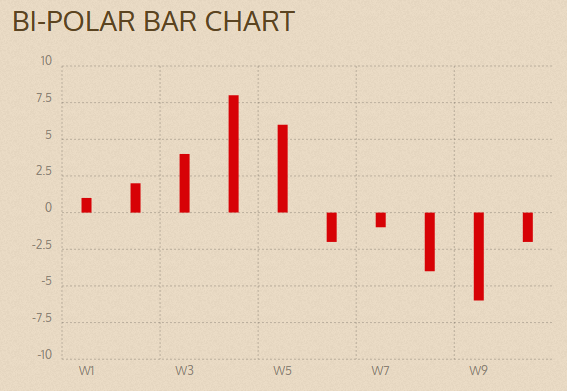

# Research charting libraries and find one that interests you 
Describe how to install the library (CDN or direct download or other)
- Depending on the favorite package manager you can use these in the command line of the package manager 
```shell
pnpm add chartist
# or
yarn add chartist
# or
npm i chartist
# or
bower install chartist --save
```
- Following the installation using the command line, all that is needed then is to import the char that is wanted and use it
```js
//i.e.
import { BarChart } from 'chartist';

new BarChart('#chart', {
  labels: ['W1', 'W2', 'W3', 'W4', 'W5', 'W6', 'W7', 'W8', 'W9', 'W10'],
  series: [
    [1, 2, 4, 8, 6, -2, -1, -4, -6, -2]
  ]
}, {
  high: 10,
  low: -10,
  axisX: {
    labelInterpolationFnc: (value, index) => (index % 2 === 0 ? value : null)
  }
});
```
- All of this information is found at this [link](https://github.com/chartist-js/chartist?tab=readme-ov-file#quickstart)

What chart types does it support?<br>
There are many chart types that it supports here is a list of them:
- Line Charts
  - Simple line chart
  - Holes in data
  - Scatter diagram
  - (Many more)
- Bar Charts
  - Horizontal bar chart
  - stacked bar charts
  - Distributed Series
  - (Many more)
- Pie Charts
  - Simple pie chart
  - Pie chart custom labels
  - Gauge Chart
  - (Many more)
What advantages and disadvantages do you see the library having over Google charts
- Although google charts does have a rich gallery and can be chosen from many different charts google charts is not open source software so there is the freedom that comes with having an open source library such as Chartist.js
- One disadvantage that could come with this is that there might be less documentation because there is likely a smaller population and fewer people working on it.
- Another advantage to Chartist.js is that there are no dependencies making the software structure more stable, where if one thing breaks it doesn't break everything

Provide either your own example or a link to an existing example of that your found on the web.
NOTE: The example should include actual code, not just a screen capture.
- This is a link to [all](https://gionkunz.github.io/chartist-js/examples.html#simple-gauge-chart) of their examples 
- The one below is one that I found very interesting showing bars but also can see a very visible trend line (bi-polar bar chart)<br>

```javascript
var data = {
  labels: ['W1', 'W2', 'W3', 'W4', 'W5', 'W6', 'W7', 'W8', 'W9', 'W10'],
  series: [
    [1, 2, 4, 8, 6, -2, -1, -4, -6, -2]
  ]
};

var options = {
  high: 10,
  low: -10,
  axisX: {
    labelInterpolationFnc: function(value, index) {
      return index % 2 === 0 ? value : null;
    }
  }
};

new Chartist.Bar('.ct-chart', data, options);

```