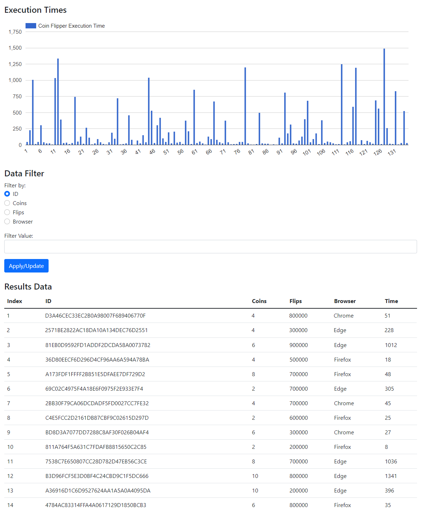
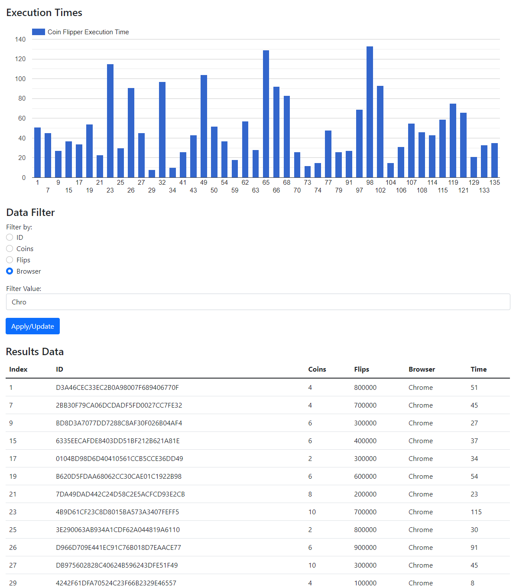

## Introduction

In this assignment, you will be using JavaScript and some sample data to create a bar chart, a data filter, and a table display.  You will also be using 3rd party libraries for styling and charting libraries to format your web application and render a chart.

Work on the assignment is to be done ***individually***.  You are welcome to collaborate with class members, but the project must be your own work.

## Background and References

Recall that in JavaScript, an object can be defined literally:

```
let person = {
    name: "roscoe", 
    age: 21,
};
```

In this case, the person object has properties that can be accessed as person.name and person.age.

Also, recall that in JavaScript, an array can be defined literally:

```
let charList = ["a", "b", "c"];
```

In this case, the charList array elements can be accessed individually as ```charList[0]```, ```charList[1]```, etc.

Combining the two concepts, we can define a literal array of objects:

```
let people = [
  { name: "roscoe", age: 21},
  { name: "rhonda", age: 22},
];
```

We can access the first person's name as ```people[0].name```, etc.

You will be using a charting library for this assignment.  The following resources might be helpful:

- Google Charts Home Page: [https://developers.google.com/chart](https://developers.google.com/chart).
- Google Charts Column Chart Reference: [https://developers.google.com/chart/interactive/docs/gallery/columnchart](https://developers.google.com/chart/interactive/docs/gallery/columnchart).
- Google Charts Visualization Reference: [https://developers.google.com/chart/interactive/docs/reference](https://developers.google.com/chart/interactive/docs/reference).

You will also need to filter and manipulate arrays for this assignment.  The following references to JavaScript array manipulation might be useful:

- Mozilla Developer Network Reference on JavaScript Arrays: [https://developer.mozilla.org/en-US/docs/Web/JavaScript/Reference/Global_Objects/Array](https://developer.mozilla.org/en-US/docs/Web/JavaScript/Reference/Global_Objects/Array).
- Array.filter Reference: [https://developer.mozilla.org/en-US/docs/Web/JavaScript/Reference/Global_Objects/Array/filter](https://developer.mozilla.org/en-US/docs/Web/JavaScript/Reference/Global_Objects/Array/filter).
- Array.map Reference: [https://developer.mozilla.org/en-US/docs/Web/JavaScript/Reference/Global_Objects/Array/map](https://developer.mozilla.org/en-US/docs/Web/JavaScript/Reference/Global_Objects/Array/map)

## Project Description

For this assignment, you will create a web application that presents coin flipper results in a table format as well as a graphical chart format.  The application will also include a user interface to allow the user to filter the data displayed in both the chart and the table.

### Part 1: Displaying the Data

The data for the table and chart is given in a pre-defined JavaScript array of objects.  Each object entry contains a unique identifier, the number of coins, to number of flips, the name of the browser, and the time (in milliseconds) to run the CoinFlipper for that result.

For example:

```
let results = 
[
  {
    id: "735C083B4F51230A23A372CB5C7CB350",
    coins: 10,
    flips: 100000,
    browser: "Chrome",
    time: 300,
  },
  {
    id: "D290A70372961ED573A9A6BB58B17265",
    coins: 5,
    flips: 1000,
    browser: "Firefox",
    time: 100,     
  },
  ...etc
];
```

The table must display the data for each object in rows.  The data for each object entry must be displayed in columns in the following order:

1. The index of the entry.  The index is the position of the entry within the array.  <br/>***NOTE:*** In order for the chart to be displayed correctly the index should be '1' based.  So you will need to add 1 to the array index
2. The unique identifier
3. The number of coins 
4. The number of flips 
5. The name of the browser 
6. The time to run the coin flipper 

The chart presents the index of the object entry on the horizontal axis (same as the index in the table).  The vertical axis is the time to run the coin flipper (also appearing in the last column of the table) corresponding to that index.



***NOTE:*** This assignment requires the use of a table to display the results below the "Data Filter".  You are free to use an HTML table, create one yourself using ```<div>``` elements or use a third party library provided the requirements for the table are met.<br/>If you are looking for a challenge consider using a [Google table chart](https://developers.google.com/chart/interactive/docs/gallery/table).

***NOTE:*** This assignment requires the use of a charting library to graph the results.  You've worked with Google charts in the past, but any charting library is allowed provided you follow the styling requirements for the chart.

***TIP:*** The index, despite being a number, should be interpreted as a string label.  When using Google charts to create your DataTable column for "Index", use a "string" data type to prevent Google charts from interpreting "Index" as a number.

### Part 2: Filtering the Data

Your web application must also allow the user to filter the displayed data based on values typed into a filter box along with a set of radio buttons to set the filter type.  This filter will adjust what is displayed in the chart and the table based on what entries match the filter.

For example, if the selects the "Browser" filter and types "Chro", only object entries containing the string "Chro" for the browser are displayed in the table as well as shown in the chart.

***NOTE:*** The original index numbers must be retained in the chart and the table.

HINT: you may want to assign each ```<tr>``` an id in order to make selection easier.

The following describes how each column filter works:

1. Unique ID Filter - Does a ***case-sensitive***, ***substring*** match 
2. Coins Filter - Numeric match.  The number the user enters must match the object entry exactly 
3. Flips Filter - Numeric match.  The number the user enters must match the object entry exactly 
4. Browser Filter - Does a ***case-sensitive***, ***substring*** match

***NOTE:*** You can assume valid user input (i.e. you do not need to verify that an input is numeric)

***NOTE:*** If nothing is typed into the "Filter Value" text field then display ***ALL*** the data (do not actually filter anything).

***NOTE:*** When displaying filtered data, the chart bars should remain next to each other with even spacing.  There should ***NOT*** be gaps in the bar chart.



### Part 3: Formatting

The elements in your web application should be styled beyond the browser defaults.  Details on required styling are as follows.

#### Chart

- Your chart must be styled to something other than your library's default.  For Google charts, this is done via the ```options``` object.  The specifics of the styling are up to you.
- When filtered bars should be ***evenly spaced*** as shown in Figure 2

#### DOM Element Styling

- Use a styling library to format your buttons, table, text fields, radio buttons, etc.  You are welcome to use Bootstrap or another of your own choosing.
- Be creative with your styling.  Your web app does ***NOT*** need to look exactly like the figures but each element should be styled in some way.

Additional styling is allowed by not required, but is allowed.  If using additional styling, place your styles in a separate CSS file.

## Getting Started

Create a WebStorm project for this assignment.  In the project you will need the files included in the repository:

- [CoinFlipCharter.html](src/CoinFlipCharter.html) - Web page HTML file (includes the imports for Bootstrap, Google Charts, and the CoinFlipCharter JavaScript files)
- [CoinFlipCharter.js](src/CoinFlipCharter.js) - JavaScript source file containing your event handlers and manipulation of the DOM 
- [CoinFlipData.js](src/CoinFlipData.js) - JavaScript source containing a single variable declaration with the coin flipper data

At the top of ***EACH SOURCE FILE*** include a comment block with your name, assignment name, and section number.

***NOTE:*** The HTML file includes the import of JavaScript files from Google Charts, Bootstrap, and the ```results``` object.  Once loaded into the web browser, the Google Charts API objects and the ```results``` object can be access via global scope.  You are welcome to use other charting and/or styling libraries of your choice.

***NOTE:*** The browser automatically includes all variables needed in a global (script) scope.  If WebStorm gives errors for undefined variables for ```google``` or ```results```, these errors can be ignored.

## Hints and Tips

### TIP: Form Submission

The behavior of the ```<form>``` tag has a special meaning in HTML, specifically when it comes to submit buttons: [https://www.w3.org/TR/html401/interact/forms.html#submit-format](https://www.w3.org/TR/html401/interact/forms.html#submit-format).  In short, form data is default submitted via a ```GET``` request to the form's [action](https://www.w3schools.com/jsref/prop_form_action.asp) target.  While we are using JavaScript with an ```onclick``` event handler, the default action is still performed when input fields and buttons are placed within a ```<form>``` tag.  This submission via a ```GET``` request has the unintended side effect of refreshing the page.

More information on the default behavior of forms can be found here: [https://medium.com/programming-essentials/3-default-behaviours-when-submitting-html-forms-adaf45c7bf23](https://medium.com/programming-essentials/3-default-behaviours-when-submitting-html-forms-adaf45c7bf23)

There are several ways to prevent this default behavior from happening.  Here are a couple:
- Just don't use a ```<form>``` tag and instead put all your input items in a ```<div>``` tag.
- Use the ```preventDefault()``` function in your event handler to prevent the event object from executing the default behavior.  For Example:

  ```javascript
  const onButtonClick = (event) => {
     event.preventDefault();
     //
     //  Other JavaScript to handle the event
     //
  }
  ```

## Deliverables

When you are ready to submit your assignment prepare your repository:

- Make sure your name, assignment name, and section number are in comments on ALL HTML, CSS, and JS file(s).
- Make sure you cite your sources for all resources outside of course material.
- Make sure your assignment code is commented thoroughly.
- Include in your submission, a set of suggestions for improvement and/or what you enjoyed about this assignment.
- Make sure all files are committed and pushed to the main branch of your repository.

***NOTE***: Do not forget to 'add', 'commit', and 'push' all new files and changes to your repository before submitting.

### Additional Submission Notes

If/when using resources from material outside what was presented in class (e.g., Google search, Stack Overflow, etc.) document the resource used in your submission.  Include exact URLs for web pages where appropriate.

NOTE: Sources that are not original research and/or unreliable sources are not to be used.  For example:

- Wikipedia is not a reliable source, nor does it present original research: [https://en.wikipedia.org/wiki/Wikipedia:Wikipedia_is_not_a_reliable_source](https://en.wikipedia.org/wiki/Wikipedia:Wikipedia_is_not_a_reliable_source)
- ChatGPT is not a reliable source: [https://thecodebytes.com/is-chatgpt-reliable-heres-why-its-not/](https://thecodebytes.com/is-chatgpt-reliable-heres-why-its-not/)

For more information, please see the [MSOE CS Code of Conduct](https://msoe.s3.amazonaws.com/files/resources/swecsc-computing-code-of-conduct.pdf).

To submit, copy the URL for your repository and submit the link to Canvas.

## Grading Criteria

- (5 Points) Correct Submission - Followed submission instructions (e.g. files are updated with name, assignment, section, sources are cited, etc.)
- (5 Points) Suggestions - a list of suggestions for improvement and/or what you enjoyed about this assignment
- (10 Points) Code Structure
  - Readable code/file structure
  - Code is well documented
  - Code passes the HTML validator without errors
  - Code passes the CSS validator without errors
- (50 Points) Functionality - Correct implementation of required functionality
  - Data is properly displayed in the chart with indexes starting at 1
  - Data is properly displayed in the table
  - All filters correctly update the chart and table
  - When filtered, chart bars have no gaps and entries retain their original index
  - When filtered, entries in the table retain their original index
- (30 Points) Styling
  - Chart is styled to something other than the default values 
  - DOM elements are styled using a styling library