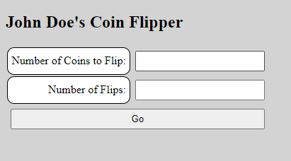
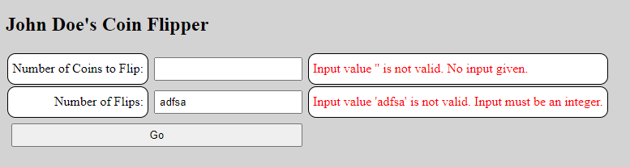
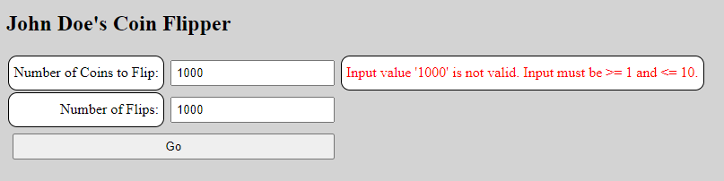
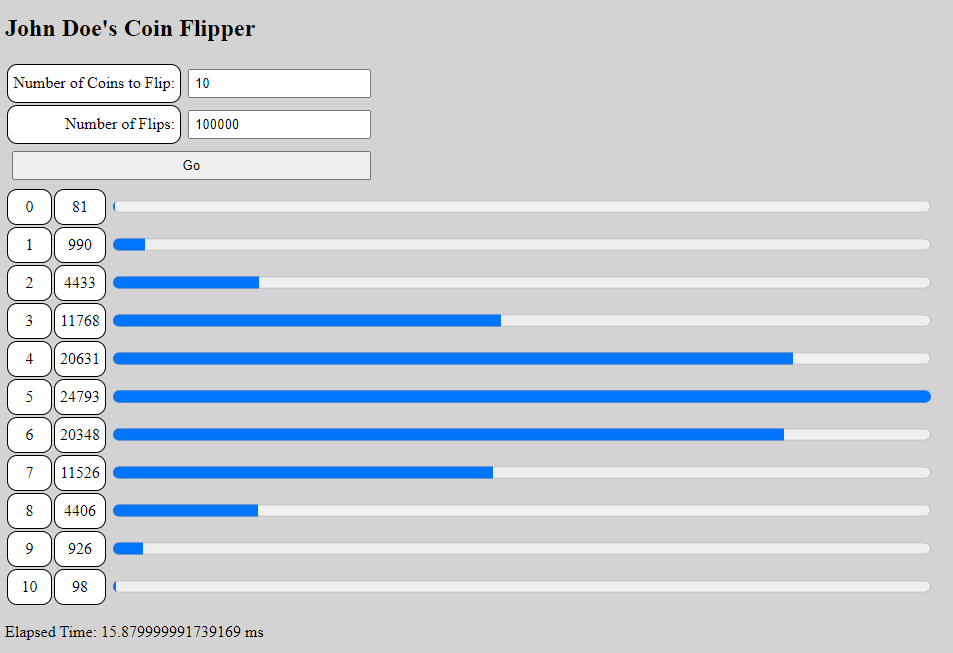

## Introduction

In this assignment, you will be re-writing the JavaScript Coin Flipper application to retrieve user input and display output via a web application rather than through the JavaScript console.

Work on the assignment is to be done ***individually***.  You are welcome to collaborate with class members, but the project must be your own work.

## Background and References

In JavaScript, the ```prompt```, ```alert```, and ```console.log``` functions can be used to retrieve input and display output to the user of a JavaScript application.  In this assignment, you will be retrieving user input using HTML form elements.  Output will be displayed by manipulating the web page's document object model (DOM) to create new HTML elements.

It may be helpful to review the tutorials for forms and events:

- Document Object Model: [https://www.w3schools.com/js/js_htmldom.asp](https://www.w3schools.com/js/js_htmldom.asp)
- HTML Forms: [https://www.w3schools.com/html/html_forms.asp](https://www.w3schools.com/html/html_forms.asp)
- JavaScript Events: [https://www.w3schools.com/js/js_events.asp](https://www.w3schools.com/js/js_events.asp)
- Bootstrap:
  - Grid: [https://getbootstrap.com/docs/5.3/layout/grid/](https://getbootstrap.com/docs/5.3/layout/grid/)
  - Progress: [https://getbootstrap.com/docs/5.3/components/progress/](https://getbootstrap.com/docs/5.3/components/progress/)
  - Tables: [https://getbootstrap.com/docs/5.3/content/tables/](https://getbootstrap.com/docs/5.3/content/tables/)
  - Buttons: [https://getbootstrap.com/docs/5.3/components/buttons/](https://getbootstrap.com/docs/5.3/components/buttons/)

## Project Description

For this assignment, you will be creating a web application for a coin flipper simulator that retrieves user input via HTML forms.

### Part 1: User Input

For this assignment, you will need to create a heading which names your application and text fields in your HTML file for both the number of coins to flip and the number of flips as well as text labels for the input fields.  Next, create a button to allow the user to 'submit' their input and run the coin flipper.  Finally, stylize the elements to something other than the default (make sure to put the styling in your CoinFlipper.css).  When you're done you'll have something that looks like this:



***NOTE:*** Use your own name instead of "John Doe" as the text for the heading

***NOTE:*** While your user input form is required to have styling beyond the browser default, it does ***NOT*** have to follow the styling in the image.

### Part 2: Validating User Input

When the "Go" button is pressed, you'll need to retrieve the values in the text fields and check them for valid values. You will need to show (via DOM scripting) error messages alongside the invalid input (and hide messages for valid input). This is the typical approach used in checkout forms in Amazon and other e-commerce sites.  Do ***NOT*** use window.alert to display error messages.

***NOTE:*** Make sure you set up a JavaScript event handler for the "Go" button.

***NOTE:*** If there is an error with the user input, clear the existing histogram if one is being displayed (see Part 3 below for details on generating the histogram).

Create a helpful error message for each type of input that is not valid. 

- The input must contain some text (e.g. not blank)
- Input values must be a positive integer (e.g. greater than 0, not negative, not a floating point number, should not contain characters)
- Input values must be inside the allowed range(s)
  - 1 to 10 (inclusive) for number of coins 
  - 1 to 1000000 (inclusive) for number of flips

***NOTE:*** Both input fields should be validated when the user clicks "Go".  If either or both have an invalid input an error message should be displayed.

When your application detects invalid input, it should display error messages.  If the input is valid any previous error message(s) should be hidden/removed.

If invalid input is detected any previously displayed histogram should be ***removed*** from the display (see below).

For example:





***NOTE:*** While a user input via text fields is required to have styling beyond the browser default, it does ***NOT*** have to follow the styling in the image.

### Part 3: Flipping the coins and creating a histogram

Now that you have valid user input, run the coin flip simulation (using the code from the previous assignment or write new code) to build a histogram for the flip counts.  Instead of printing the histogram to the console using ```console.log``` you will need to dynamically create HTML elements to graphically display the histogram. 

The histogram must be formatted in rows (but does not necessarily need to be table element):

- The first column indicates the number of heads
- The second column indicates the number of times that number of heads occurred
- The third column shows a graphical representation of the number of heads

***NOTE:*** You are not allowed to use asterisk characters for the third column.  You must use an HTML graphical element.  This can be done using the [HTML progress](https://www.w3schools.com/tags/tag_progress.asp) element OR create your own.  The value of the progress should indicate the number of heads for the given coin.

You will need to 'normalize' (scale) the max value for the progress/meter so that the largest bar fills the element.  All other bars should be scaled accordingly.

Here is an example histogram:



***NOTE:*** Don't forget to include the elapsed time in ms used to compute the distribution.  Do ***NOT*** include the time to display the histogram.

***NOTE:*** If the user clicks on 'Go' multiple times, generate a new histogram that ***replaces*** the existing histogram.  Do ***NOT*** append another histogram to the screen.

### Part 4: CSS Styling

Use CSS style rules to style your input fields, labels, and histogram.  Choose your own colors, fonts, font sizes, table borders.  You may use [Bootstrap](https://getbootstrap.com/) to style your page (refer to the Bootstrap reference for Grids, Tables, Progress Bars, Buttons, etc.) or any other styling library you choose.  However, you must adhere to the following few requirements:

- Style the histogram bars to take up the majority (90% to 100%) of the overall width of the output portion of the display (the default width for the &lt;progress&gt; elements is rather small). You'll have to compute a scaling factor based on the longest histogram line to do this.
- Similarly, make the error message area wide enough to present those messages on only 1 or 2 lines.

***NOTE:*** If using a third party CSS library make sure you properly include the CDN in your HTMl file.

## Getting Started

The following files have been provided for you in your repository:

- [src/CoinFlipper.html](src/CoinFlipper.html) - The markup file for your web page
- [src/CoinFlipper.js](src/CoinFlipper.js) - The file containing your JavaScript source
- [src/CoinFlipper.css](src/CoinFlipper.css) - The file containing styling for your web page

At the top of ***EACH SOURCE FILE*** include a comment block with your name, assignment name, and section number.

## Hints and Tips

TIP: How do I check for input text that is not a number?  Use the [isNaN function](https://www.w3schools.com/jsref/jsref_isnan.asp).

TIP: How do I check for an integer input?  You can use a trick using the [isInteger function](https://www.w3schools.com/jsref/jsref_isinteger.asp) combined with the [parseFloat](https://www.w3schools.com/jsref/jsref_parsefloat.asp) function.

Putting it all together you can get:

```javascript
const isInputAnInteger = (value) => {
    // Make sure the input string is a number
    if(isNaN(value)) {
        return false;
    }
    // We now know the string contains a number, but is it an integer?
    // Parse the string to a float (decimal with precision) and then verify that it is an integer
    if(!Number.isInteger(parseFloat(value))) {
        return false;
    }
    // The input string is a number and an integer
    return true;
}
```

### TIP: Form Submission

The behavior of the ```<form>``` tag has a special meaning in HTML, specifically when it comes to submit buttons: [https://www.w3.org/TR/html401/interact/forms.html#submit-format](https://www.w3.org/TR/html401/interact/forms.html#submit-format).  In short, form data is default submitted via a ```GET``` request to the form's [action](https://www.w3schools.com/jsref/prop_form_action.asp) target.  While we are using JavaScript with an ```onclick``` event handler, the default action is still performed when input fields and buttons are placed within a ```<form>``` tag.  This submission via a ```GET``` request has the unintended side effect of refreshing the page.

More information on the default behavior of forms can be found here: [https://medium.com/programming-essentials/3-default-behaviours-when-submitting-html-forms-adaf45c7bf23](https://medium.com/programming-essentials/3-default-behaviours-when-submitting-html-forms-adaf45c7bf23)

There are several ways to prevent this default behavior from happening.  Here are a couple:
- Just don't use a ```<form>``` tag and instead put all your input items in a ```<div>``` tag.
- Use the ```preventDefault()``` function in your event handler to prevent the event object from executing the default behavior.  For Example:

  ```javascript
  const onButtonClick = (event) => {
     event.preventDefault();
     //
     //  Other JavaScript to handle the event
     //
  }
  ```

## Validation and Testing

- Be sure to test your application for various combinations of inputs (both good and bad) to validate that the generated output is correct.
- Be sure to check that the CoinFlipper web page contains valid HTML.  Make sure to run it through the [HTML validator](https://validator.w3.org/).  Keep in mind that you can't simply check the original CoinFlipper.html file - you'll be dynamically generating HTML to display the histograms and error messages, so be sure to validate the page for various combinations of output (including no output).
- Be sure to check that the CoinFlipper.css contains valid CSS rules.  Make sure to run it through the [CSS validator](http://jigsaw.w3.org/css-validator/).
- Run the application in several browsers; minimally, Chrome, and Firefox. You might want to try running it on your phone.
- Make sure that when you rerun your application with different input, you reinitialize your data variables appropriately so that they do not retain values from previous runs.

## Deliverables

When you are ready to submit your assignment prepare your repository:

- Make sure your name, assignment name, and section number are in comments on ALL HTML, CSS, and JS file(s).
- Make sure you have completed all activities and answered all questions.
- Make sure you cite your sources for all research.
- Make sure your assignment code is commented thoroughly.
- Include in your submission, a set of suggestions for improvement and/or what you enjoyed about this assignment.
- Make sure all files are committed and pushed to the main branch of your repository.

***NOTE***: Do not forget to 'add', 'commit', and 'push' all new files and changes to your repository before submitting.

### Additional Submission Notes

If/when using resources from material outside what was presented in class (e.g., Google search, Stack Overflow, etc.) document the resource used in your submission.  Include exact URLs for web pages where appropriate.

NOTE: Sources that are not original research and/or unreliable sources are not to be used.  For example:

- Wikipedia is not a reliable source, nor does it present original research: [https://en.wikipedia.org/wiki/Wikipedia:Wikipedia_is_not_a_reliable_source](https://en.wikipedia.org/wiki/Wikipedia:Wikipedia_is_not_a_reliable_source)
- ChatGPT is not a reliable source: [https://thecodebytes.com/is-chatgpt-reliable-heres-why-its-not/](https://thecodebytes.com/is-chatgpt-reliable-heres-why-its-not/)

For more information, please see the [MSOE CS Code of Conduct](https://msoe.s3.amazonaws.com/files/resources/swecsc-computing-code-of-conduct.pdf).

To submit, copy the URL for your repository and submit the link to Canvas.

## Grading Criteria

- (5 Points) Correct Submission - Followed submission instructions (e.g. files are updated with name, assignment, section, sources are cited, etc.)
- (5 Points) Suggestions - a list of suggestions for improvement and/or what you enjoyed about this assignment
- (10 Points) Code Structure
  - Readable code/file structure
  - Code is well documented
  - Code passes the HTML validator without errors
  - Code passes the CSS validator without errors
- (40 Points) Functionality - Correct implementation of required functionality
  - Histogram is displayed using DOM elements
  - Only a single histogram is shown - with repeated runs the old histogram is removed
  - Histogram bars are normalized so the longest occurrence use 100% of the bar
  - Histogram bars take up the majority of the page width
- (20 Points) Error Checking
  - Comprehensive error checking for "bad" input (0, negative, or alphabetic input values must not be allowed)
  - Number of coins must be between 1 and 10 inclusive
  - Number of flips must be between 1 and 1000000 inclusive
  - Error message is displayed not using window.alert
  - Error message is only displayed when there is invalid user input
  - Histogram is removed when an error message is displayed
- (20 Points) Styling - Web page contains custom styling