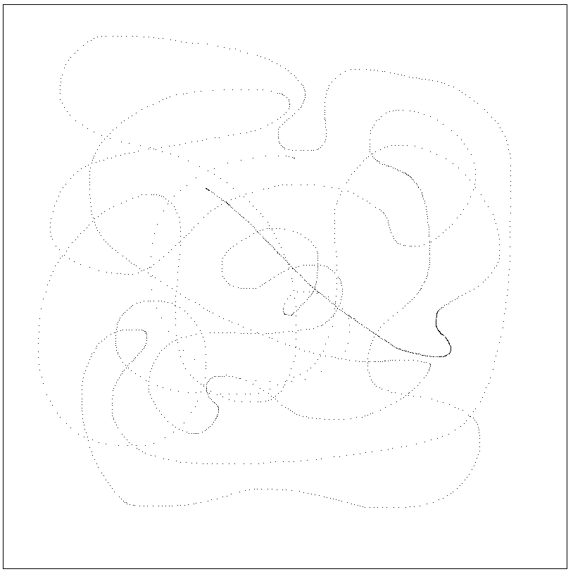

## Introduction

In this assignment, you will be using your knowledge and research to create a drawing web application using the JavaScript, CSS, and the HTML canvas.

Include source files for all programs in your submission.  Follow good styling for programming questions and provide complete documentation (comment blocks, inline comments for complicated code, etc.).

Work on the assignment is to be done with ***your assigned group***.  You are welcome to collaborate with class members, but the submitted assignment must be the work of only your group.

## Background and References

In this assignment you will be using an HTML canvas to make a drawing program.  The following references might be helpful

- W3 Schools HTML Canvas Reference and Tutorial: [https://www.w3schools.com/graphics/canvas_intro.asp](https://www.w3schools.com/graphics/canvas_intro.asp)
- Mozilla Developer Network Tutorial on WebGL: [https://developer.mozilla.org/en-US/docs/Web/API/WebGL_API/Tutorial](https://developer.mozilla.org/en-US/docs/Web/API/WebGL_API/Tutorial)
- Mozilla Developer Network Reference on Canvas API: [https://developer.mozilla.org/en-US/docs/Web/API/Canvas_API](https://developer.mozilla.org/en-US/docs/Web/API/Canvas_API)
- TutorialPoint WebGL Tutorial: [https://www.tutorialspoint.com/webgl/index.htm](https://www.tutorialspoint.com/webgl/index.htm)

## Project Description

For this project you must create a web application that allows a user to draw on the screen, similar to Microsoft Paint: [https://apps.microsoft.com/store/detail/paint/9PCFS5B6T72H](https://apps.microsoft.com/store/detail/paint/9PCFS5B6T72H).

You will need to use an HTML Canvas ```<canvas>``` to represent your drawing area.  This assignment is divided into several parts to allow you build your application in stages:

1. Learning the HTML Canvas
2. Building the basic drawing application
3. Adding additional features to the drawing application
4. Documenting the added features

### Learning the HTML Canvas

The HTML canvas presents an area which can be used to render (draw) elements (lines, rectangle, paths, images, or even 3-dimensional assets).  Within the HTML structure is represented as an inline element.  However, JavaScript can be used to access the canvas "context" which allows for drawing.

The website Tutorials Point has quite a few tutorials to help you learn topics from web development, to programming languages, to operating systems.  For this activity, you will read through the tutorial for the HTML canvas and create some examples to get you used to working the HTMl canvas context.

1. Read through the HTML Canvas tutorial from Tutorials Point: [https://www.tutorialspoint.com/html5/html5_canvas.htm](https://www.tutorialspoint.com/html5/html5_canvas.htm)
2. At the bottom of the tutorial is a link to several examples.  For the following example sections:
   - Drawing Rectangles (1)
   - Drawing Paths (2)
   - Drawing Lines (3)
   - Styles and Colors (8)
   - One other section of your choice
   <br/><br/>
   1. Read through the tutorial examples and familiarize yourself with what is written
   2. Create your own example showing the feature.  Include your example in your submission<br/>
      ***NOTE:*** Feel free to include all examples in the same JavaScript file

### The Basic Drawing Application

Start by creating the structure and styling for your drawing application.  At a minimum, it ***must*** consist of an HTML canvas for the drawing.

Additional styling of the elements is up to you, but must be something other than the browser default.  You are welcome to use a 3rd party styling library or make your own.  Be creative.

***NOTE:*** The only styling requirement is the canvas ***must*** be 800 pixels high by 800 pixels wide ***AND*** must have a border.

#### Development Requirements

Your drawing application ***must*** allow the user to draw on the canvas.  This will be done via a click-and-drag approach:

- When the user moves their mouse over the screen nothing should be drawn
- Once the user click the mouse down, a pixel should be filled in on the canvas at the mouse location
- If the user continues to hold the mouse down and drags the mouse additional pixels should be filled in wherever the mouse is moved to
- When the user releases the mouse the drawing stays the same, and additional pixels are not filled in.

This behavior is similar to the "pencil" tool in Microsoft Paint.

***NOTE:*** The color of the pixels can be any color of your choice.

Here is an example:



Clicking and dragging in the canvas draws pixels at the mouse location ***and*** as the mouse is moved.

#### Hints and Tips

- A canvas needs to know how big it is (height and width) via the ```height``` and ```width``` attributes on the canvas HTML element.  Using CSS to set the canvas height will cause it to not draw correctly.  Ths has been done for you in the given files.
- The HTML canvas API does not have a draw pixel function.  Consider using the ```fillRect``` with a height and width of 1

Tracking the mouse:

- To determine if the mouse has moved use the ```onmousemove``` event
- The way to get the mouse location requires the use of the mouse ```event``` object passed to all event handlers: [https://developer.mozilla.org/en-US/docs/Web/API/MouseEvent](https://developer.mozilla.org/en-US/docs/Web/API/MouseEvent)
- The x and y coordinate of the mouse location will be ```event.clientX``` and ```event.clientY```
  - [https://developer.mozilla.org/en-US/docs/Web/API/MouseEvent/clientX](https://developer.mozilla.org/en-US/docs/Web/API/MouseEvent/clientX)
  - [https://developer.mozilla.org/en-US/docs/Web/API/MouseEvent/clientY](https://developer.mozilla.org/en-US/docs/Web/API/MouseEvent/clientY)
- ***NOTE:*** The ```clientX``` and ```clientY``` consist of the x and y coordinate of the mouse in relation to the ***browser*** they are ***NOT*** in relation to the canvas element.  To get the location of the mouse in relation to the canvas element, you need to subtract the location of the canvas.
  - Question: How do you find the location of a DOM element?
  - Answer: You have to retrieve the bounding rectangle: [https://developer.mozilla.org/en-US/docs/Web/API/Element/getBoundingClientRect](https://developer.mozilla.org/en-US/docs/Web/API/Element/getBoundingClientRect)
  
    ```javascript
    const onHandleMouseMove = (event) => {
        // Retrieve the canvas location
        const canvas = document.getElementById("my_canvas");
        const canvasLocation = canvas.getBoundingClientRect();
    
        // Determine the coordinate to draw based on the client (mouse)
        //   x and y coordinate subtracting the canvas location (left and top)
        const drawXCoord = event.clientX - canvasLocation.left;
        const drawYCoord = event.clientY - canvasLocation.top;
    }
    ```

### Adding Features

Now that you have the base features implemented, add ***6*** additional features to make your drawing application more complete.  The exact features are up to you, but they must follow some requirements
Add new features to the drawing application:

- One feature must include some sort of user input with validation
- Any new component or HTML element ***must*** be styled to something other than the browser default
  - Consider using styling and components from a 3rd party styling library
- Be creative, brainstorm with your group members on what would be useful to add.  Here are some ideas:
  - Add a color picker
    - HTML includes a color input that might be helpful here: [https://www.w3schools.com/tags/att_input_type_color.asp](https://www.w3schools.com/tags/att_input_type_color.asp) 
  - Add an erase or color fill button 
  - Add a pen selector to allow the user to change the shape or the size of the shape that does the "painting"
  - Use WebGL to draw 3D images (see the references section for help)
  - Allow the user to save and download their drawing as an image file
    - ***NOTE:*** The HTML canvas allows saving by default by right-clicking on the canvas.  If you choose to implement a saving feature it must include a **different** user interface than the right-click to save. 
  - Save the work to local storage so the user can continue if their browser crashes
  - Find a way to perform "smooth" drawing so that the drawn lines are continuous even if the mouse is moved fast
  - Do a Google search to find an interesting painting library to incorporate
    - Be sure to cite your sources

While styling through CSS could be considered an additional feature, it won't count for this assignment.

### Documentation

Include in a ***separate file*** (document, text file, etc.) documentation for your implemented features.  For ***each*** feature:

- Give a paragraph description of what it is and how to use it
- How does the function work?
- How do you use the function?
- What is it useful for?

For 3rd party libraries and external resources:

- Documentation of each external library you used (if you choose to do so)
  - Give the location (URL) 
  - Write a paragraph description of the library function
- Description of each other resource (include a URL) outside of course material you used

## Getting Started

The following files have been provided for you in your repository:

- [src/drawing.html](src/drawing.html) - HTML with the structure for your application
- [src/drawing.css](src/drawing.css) - CSS file for your application styling
- [src/drawing.js](src/drawing.js) - JavaScript for the behavior of your application

The HTML file is set up to link the CSS and JavaScript file.  It also includes a canvas and some initial styling to get you started.  Feel free to change any and all of what you are given provided your final application fulfills the development requirements.

If using a 3rd party library make sure to include that in your HTML file.

At the top of ***EACH SOURCE FILE*** include a comment block with your names, assignment name, and section number.

## Deliverables

When you are ready to submit your assignment prepare your repository:

- Make sure your name, assignment name, and section number are in comments on ALL HTML, CSS, and JS file(s).
- Make sure you have completed all activities and answered all questions.
- Make sure you cite your sources for all research.
- Make sure your assignment code is commented thoroughly.
- Include in your submission, a set of suggestions for improvement and/or what you enjoyed about this assignment.
- Make sure all files are committed and pushed to the main branch of your repository.

***NOTE***: Do not forget to 'add', 'commit', and 'push' all new files and changes to your repository before submitting.

### Additional Submission Notes

If/when using resources from material outside what was presented in class (e.g., Google search, Stack Overflow, etc.) document the resource used in your submission.  Include exact URLs for web pages where appropriate.

NOTE: Sources that are not original research and/or unreliable sources are not to be used.  For example:

- Wikipedia is not a reliable source, nor does it present original research: [https://en.wikipedia.org/wiki/Wikipedia:Wikipedia_is_not_a_reliable_source](https://en.wikipedia.org/wiki/Wikipedia:Wikipedia_is_not_a_reliable_source)
- ChatGPT is not a reliable source: [https://thecodebytes.com/is-chatgpt-reliable-heres-why-its-not/](https://thecodebytes.com/is-chatgpt-reliable-heres-why-its-not/)

For more information, please see the [MSOE CS Code of Conduct](https://msoe.s3.amazonaws.com/files/resources/swecsc-computing-code-of-conduct.pdf).

To submit, copy the URL for your repository and submit the link to Canvas.

## Grading Criteria

- (5 Points) Submitted files follow submission guidelines
  - Only the requested files were submitted
  - Files are contain name, assignment, section
  - Sources outside of course material are cited
- (5 Points) Suggestions
  - List of suggestions for improvement and/or what you enjoyed about this assignment
- (10 Points) Code Structure
  - Readable code/file structure
  - Code is well documented
  - Code passes the HTML validator without errors
  - Code passes the CSS validator without errors
  - HTML only contains structure - no logic code or styling
- (15 Points) Learning the HTML Canvas
- (25 Points) The Basic Drawing Application
- (25 Points) Adding Features
- (15 Points) Documentation
