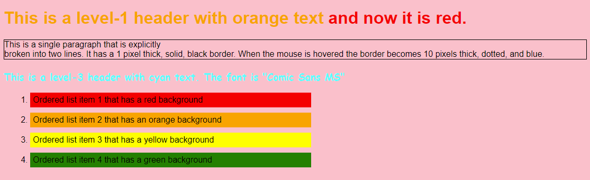
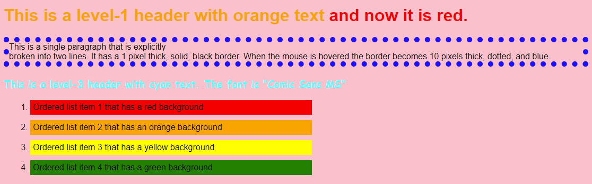

## Introduction

The purpose of this assignment is to introduce you to HyperText Markup Language (HTML) and Cascading Style Sheets (CSS).

For this assignment, you may be asked to answer questions and/or write some code.  Provide complete answers to all written questions:  When asked for examples, be specific.  Submit your answers in a document separate from code.

Include source files for all programs in your submission.  Follow good styling for programming questions and provide complete documentation (comment blocks, inline comments for complicated code, etc.).

Work on the assignment is to be done with ***your assigned group***.  You are welcome to collaborate with class members, but the submitted assignment must be the work of only your group.

## Background and References

For this assignment you will be using HTML and CSS.  In addition to what was discussed in class the following resources may be helpful:

- HTML Reference from W3Schools: [https://www.w3schools.com/html/default.asp](https://www.w3schools.com/html/default.asp)
- CSS Reference from W3Schools: [https://www.w3schools.com/css/default.asp](https://www.w3schools.com/css/default.asp)
- HTML Validator: [http://validator.w3.org/](http://validator.w3.org/)
- CSS Validator: [http://jigsaw.w3.org/css-validator/](http://jigsaw.w3.org/css-validator/)

## W3Schools Tutorial and Exercises

### HTML Exercises

Complete the following HTML exercise sections and read through their corresponding tutorials from W3Schools [https://www.w3schools.com/html/exercise.asp](https://www.w3schools.com/html/exercise.asp):

Complete the exercises for the following sections:

- HTML Attributes
- HTML Headings
- HTML Paragraphs
- HTML Styles
- HTML Formatting
- HTML Quotations
- HTML Comments
- HTML Links
- HTML Images
- HTML Tables
- HTML Lists

When you have completed the exercises, create a screen capture, or other method to show proof of completion, and include this in your submission.

### CSS Exercises

Complete the following CSS exercise sections and read through their corresponding tutorials from W3Schools [https://www.w3schools.com/css/exercise.asp]( https://www.w3schools.com/css/exercise.asp):

Choose and complete **10** other exercise sections of your choosing.  Find ones that interest you.

When you have completed the exercises, create a screen capture, or other method to show proof of completion,  and include this in your submission.

## Research and Discovery

### HTML

HTML has evolved since its original creation as a method for marking up documents.  We will cover several HTML tags in class, but won't be able to exhaustively cover all of them.

- Search the list of HTML tags and find **four (4)** (other than the ones covered in class), that you find interesting.  Here are some resources:
    - [https://www.w3schools.com/tags/default.asp](https://www.w3schools.com/tags/default.asp)
    - [https://developer.mozilla.org/en-US/docs/Web/HTML/Element](https://developer.mozilla.org/en-US/docs/Web/HTML/Element)
- For ***EACH*** tag, research the tag and answer the following:
    - What is the tag used for?
    - Name and describe the options (attributes) that the tag supports.
    - Write an example of its use (i.e. an explicit code example of it being used)

***NOTE:*** Make sure to cite your resources for ***EACH*** tag separately - even if using the ones mentioned above.

### CSS

CSS has a history that extends almost as long as HTML ([https://css-tricks.com/look-back-history-css/](https://css-tricks.com/look-back-history-css/)).  It has undergone many additions and features with each version release.  In class, we will cover CSS syntax and some selector, attributes, and features of CSS, but won't be able to exhaustively cover all of them.

- Search the CSS reference and find **four (4)** selectors, attributes, or other CSS feature (other than the ones covered in class) that you find interesting.  Here are some resources:
    - [https://www.w3schools.com/css/default.asp](https://www.w3schools.com/css/default.asp)
    - [https://developer.mozilla.org/en-US/docs/Web/CSS](https://developer.mozilla.org/en-US/docs/Web/CSS)
- For ***EACH*** feature, research the feature and answer the following:
    - What is the feature used for?
    - Name and describe the values, options, or methods that the feature supports.
    - Write an example of its use (i.e. an explicit code example of it being used).

***NOTE:*** Make sure to cite your resources for ***EACH*** item individually - even if using the ones mentioned above.

## Creating a Styled Web Page

Now that you have explored and become familiar with HTML and CSS, use this knowledge to create a web page that fits the structure and formatting from the given screen captures.

The screen captures describe the formatting in the wording of each part.  Specific details of the web page that are not stated in the page itself:

- Unless otherwise stated, the font for the web page must be "Arial"
- The font color unless explicitly stated must be black
- The background color must be pink
- The title of the page must be your name (not the string 'Your Name')
- The ordered list must take up 50% of the page width 
  ***NOTE:*** This is may not be accurately displayed in the screen captures below.  Make sure your submission includes this formatting
- Each ordered list item has a margin of 10 pixels on all sides
- Each ordered list item has a padding of 5 pixels on all sides

### Additional Requirements

- You must create one HTML file containing the structure of the page and at least one separate CSS file containing the formatting.  Do ***NOT*** put CSS styling directly into the HTML file.
- Make sure your HTML passes the [HTML Validator](https://validator.w3.org/) without errors.
- Make sure your CSS passes the [CSS Validator](https://jigsaw.w3.org/css-validator/) without errors.

***NOTE:*** The following two images indicate what the page content should look like.  There are 2 images included:

1. The first image is a display of the page when the mouse is ***NOT*** hovered over the paragraph
2. The second image is a display of the page when the mouse ***IS*** hovered over the bottom paragraph

Page displayed when the mouse is ***NOT*** hovered over the paragraph at the bottom:

Page displayed when the mouse ***IS*** hovered over the paragraph at the bottom:

## Getting Started

The following files have been provided for you in your repository:

- [src/index.html](src/index.html) - HTML file to contain the structure for the "Creating a Styled Web Page"
- [src/style.css](src/style.css) - CSS file to contain the style of the "Creating a Styled Web Page"

At the top of ***EACH SOURCE FILE*** include a comment block with your name, assignment name, and section number.

## Deliverables

When you are ready to submit your assignment prepare your repository:

- Make sure your name(s), assignment name, and section number are in comments on ALL HTML and CSS file(s).
- Make sure you have completed all activities and answered all questions.
- Make sure you cite your sources for all research.
- Make sure your assignment code is commented thoroughly.
- Include in your submission, a set of suggestions for improvement and/or what you enjoyed about this assignment.
- Make sure all files are committed and pushed to the main branch of your repository.

***NOTE***: Do not forget to 'add', 'commit', and 'push' all new files and changes to your repository before submitting.

### Additional Submission Notes

If/when using resources from material outside what was presented in class (e.g., Google search, Stack Overflow, etc.) document the resource used in your submission.  Include exact URLs for web pages where appropriate.

***NOTE:*** Sources that are not original research and/or unreliable sources are not to be used.  For example:

- Wikipedia is not a reliable source, nor does it present original research: [https://en.wikipedia.org/wiki/Wikipedia:Wikipedia_is_not_a_reliable_source](https://en.wikipedia.org/wiki/Wikipedia:Wikipedia_is_not_a_reliable_source)
- ChatGPT is not a reliable source: [https://thecodebytes.com/is-chatgpt-reliable-heres-why-its-not/](https://thecodebytes.com/is-chatgpt-reliable-heres-why-its-not/)

For more information, please see the [MSOE CS Code of Conduct](https://msoe.s3.amazonaws.com/files/resources/swecsc-computing-code-of-conduct.pdf).

To submit, copy the URL for your repository and submit the link to Canvas.

## Grading Criteria

- (5 Points) Submitted files follow submission guidelines
  - Only the requested files were submitted
  - Files are contain name, assignment, section
  - Sources outside of course material are cited
- (5 Points) Suggestions
  - List of suggestions for improvement and/or what you enjoyed about this assignment
- (10 Points) HTML W3Schools Exercises
- (10 Points) CSS W3Schools Exercises
- (15 Points) HTML Tag Research 
  - Make sure to cite your resources
- (15 Points) CSS Research 
  - Make sure to cite your resources
- (40 Points) Create a Styled Web page
  - (10 Points) Code Structure
    - Readable code/file structure
    - Code is well documented
    - Code passes the HTML validator without errors
    - Code passes the CSS validator without errors
  - (30 Points) Structure and Styling 
    - Webpage is structured and styled according to the requirements defined