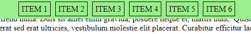
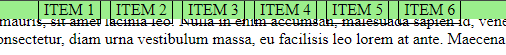
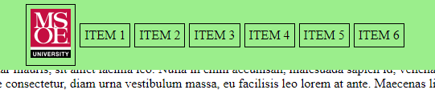
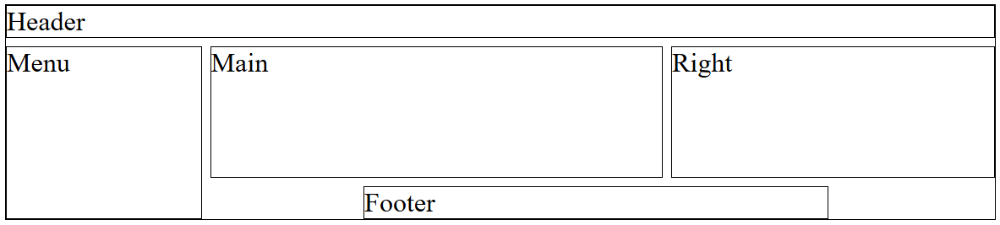
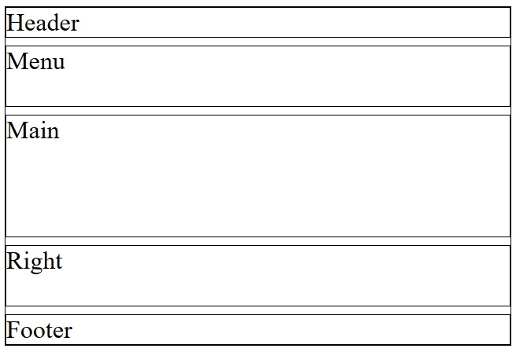

## Introduction

The purpose of this assignment is to introduce you to web page layout managers and how to manipulate layouts using cascading style sheets (CSS).

For this assignment, may be asked to answer questions, perform research, and/or write code.

- Provide complete answers to all written questions.
- When asked for examples, be specific.
- When asked to perform research, cite your sources.
- Submit your answers in a document separate from code.

Include source files for all programs in your submission.  Follow good styling for programming questions and provide complete documentation (comment blocks, inline comments for complicated code, etc.).

Work on the assignment is to be done with ***your assigned group***.  You are welcome to collaborate with class members, but the submitted assignment must be the work of only your group.

## Background and References

While and HTML file indicates the structure of a web page, ultimately the browser needs to render that structure as an interface to the user.  To do this, the web browser utilizes layout managers to decide how HTML elements are positioned on the screen.

There are many layout managers available to a web developer.  Arguably, the three most used layouts are flow, flexible box, and grid.  In this assignment, you will be experimenting with different layout managers and position methods in CSS.

The following references may be useful:

- CSS Positioning - [https://developer.mozilla.org/en-US/docs/Web/CSS/CSS_positioned_layout])(https://developer.mozilla.org/en-US/docs/Web/CSS/CSS_positioned_layout)
- CSS Flow Layout - [https://developer.mozilla.org/en-US/docs/Web/CSS/CSS_flow_layout](https://developer.mozilla.org/en-US/docs/Web/CSS/CSS_flow_layout)
- CSS Flexible Box Layout - [https://developer.mozilla.org/en-US/docs/Web/CSS/CSS_flexible_box_layout](https://developer.mozilla.org/en-US/docs/Web/CSS/CSS_flexible_box_layout)
- CSS Grid Layout - [https://developer.mozilla.org/en-US/docs/Web/CSS/CSS_grid_layout](https://developer.mozilla.org/en-US/docs/Web/CSS/CSS_grid_layout)

## Positioning

### W3Schools Positioning Tutorial and Exercises

Complete the following CSS exercise sections and read through their corresponding tutorials from W3Schools [https://www.w3schools.com/css/exercise.asp](https://www.w3schools.com/css/exercise.asp):

- CSS Margin
- CSS Padding
- CSS Height/Width
- CSS Box Model
- CSS Positioning
- CSS Z-index
- CSS Overflow
- CSS Align

When you have completed the exercises, create a screen capture, or other method to show proof of completion, and include this in your submission.

### Positioning Research

Research the following values for the ```position``` attribute.
- Describe each in your own words
- Describe a situation when you'd use each
- Support your descriptions with a CSS code example for each

Position values:
- static
- absolute
- relative
- fixed
- sticky

Once you have completed, your research and finished your descriptions, answer the following:

For the ```absolute``` position, the element with ```position: absolute;``` is positioned relative to the nearest positioned ancestor (instead of positioned relative to the viewport, like fixed)." ~[https://www.w3schools.com/css/css_positioning.asp](https://www.w3schools.com/css/css_positioning.asp)

***Question:*** What does "nearest positioned ancestor" mean?  Provide a description ***AND*** an example.

## Flow Layout

The flow layout is the default layout manager for HTML elements on a web page.  It is often referred to as the "normal flow" of HTML elements.  It is governed by several values in the ```display``` CSS attribute.

### Flow Layout Research

#### Flow Layout Manager Research
Research the flow layout manager and describe how elements are laid out using the manager.

#### Display Property Research
Research the following values for the ```display``` attribute.
- Describe each in your own words
- Describe a situation when you'd use each

Display values:
- block
- inline
- inline-block

#### Writing Mode Research
The flow layout has an interesting property called writing mode that effects the orientation of HTML elements in the flow layout.

Research the ```writing-mode``` attribute and describe it in your own words.  What does "directionality of script" mean?  Support your answer with a specific example of left-to-right (ltr) and right-to-left (rtl).

Research the following values for the ```writing-mode``` attribute
- Describe each in your own words
- Describe a situation when you'd use each

Writing mode values:
- horizontal-tb
- vertical-rl
- vertical-lr
- sideways-rl
- sideways-lr

### Flow Layout Exercises

#### Exercise 1 - Floating Box

You are given an HTML file for a web app that consists of some paragraphs and an image: [src/flow/flow1.html](src/flow/flow1.html).

Complete the CSS [src/flow/flow1.css](src/flow/flow1.css) so that:
- The font size of the paragraphs grows as the window width increases
  - The font size must be 3 percent of the view width 
  - The font size must be no smaller than 1em
  - ***HINT:*** See the CSS max function: [https://developer.mozilla.org/en-US/docs/Web/CSS/max](https://developer.mozilla.org/en-US/docs/Web/CSS/max)
- The image size must increase as the screen width increases
  - The image width must be 30 percent of the view width
  - The image must be no larger than 200 pixels wide
  - The height of the image must increase proportional to the width
  - ***HINT:*** See the CSS min function: [https://developer.mozilla.org/en-US/docs/Web/CSS/min](https://developer.mozilla.org/en-US/docs/Web/CSS/min)
- The image 'floats' above the rest of the page and is always located at the bottom, right corner of the browser window
  - The image must not go beyond any edge of the browser window

***NOTE:*** Do ***NOT*** change the HTML file.  Only change the CSS file.

#### Exercise 2 - Navigation Bar

You are given an HTML file for a web app that consists of a ```div``` containing the HTML elements for a navigation bar and a container for paragraphs: [src/flow/flow2.html](src/flow/flow2.html).

Complete the CSS [src/flow/flow2.css](src/flow/flow2.css) so that:
- Navigation Bar Behavior
  - The navigation bar is always displayed at the top of the page even when the page scrolls.
  - The navigation items (CSS class "nav") must be laid out horizontally
  - The background color of the navigation bar should be opaque (not see through) and set to a color other than the browser default.
  - The paragraphs must scroll behind the navigation bar.
  - When the browser scroll bar is all the way to the top there must ***NOT*** be any paragraph behind the navigation bar
  - The navigation bar must be centered horizontally in the browser window.
    - ***HINT:*** See the CSS text-align property: [https://developer.mozilla.org/en-US/docs/Web/CSS/text-align](https://developer.mozilla.org/en-US/docs/Web/CSS/text-align)
- Navigation Bar Spacing
  - There must be a 5 pixel spacing inside the navigation bar
  - There must be a 1 pixel boarder around each navigation bar element
  - There must be a 5 pixel spacing inside the border of each navigation bar element
  - There must be a 5 pixel gap between navigation bar items

When all requirements are met, the navigation bar should look similar to the following: 



Notice that the text is covered by the navigation bar background and is not visible through the navigation bar.

The following example image shows ***incorrect*** behavior:



Notice here that the borders of the navigation bar elements overlap the text behind them.
- ***HINT:*** You may have to add additional padding to fill out the navigation bar

***NOTE:*** Do ***NOT*** change the HTML file.  Only change the CSS file.

***NOTE:*** For this exercise you ***MUST*** use the flow layout manager (e.g. display CSS property values must use inline, block, or inline-block).

## Flex Layout

The flex layout allows the programmer more control over 'rows' of HTML elements on a web page.  In the flex layout, HTML elements considered items and are contained in a flex container.  It is enabled by setting the ```display``` CSS attribute to ```flex```.

#### Flex Layout Manager Research
Research the flex layout manager and describe how the layout of elements can be customized by altering the container CSS properties.   For each of the following CSS properties for a flex container:
- Describe what each property does in your own words
- Describe a situation when you'd use each

Flex Container Properties:
- grid-template-columns
- flex-wrap
- justify-content
- align-items
- align-content
- gap

The flex layout also allows customization of individual items.  This can be done by altering the CSS properties of the items contained within the container.  For each of the following CSS properties for items in a flex container:
- Describe what each property does in your own words
- Describe a situation when you'd use each

Flex Item Properties:
- order
- flex-grow
- flex-shrink
- flex-basis
- align-self

### Flex Layout Exercises

#### Exercise 1 - Cards

You are given an HTML file for a web app that consists of several ```div``` tags containing the structure for HTML 'cards'.  These 'cards' include an image two different sized headings and some text.

Complete the CSS [src/flow/flex1.css](src/flex/flex1.css) so that:
- The card elements must all be 300 pixels wide and their size should not change as the browser window size changes
- The card container (CSS class "cards") should contain a horizontal scroll bar if the width of the cards is wider than the browser window
- There must be a 1 pixel boarder around each card element
- There must be a 5 pixel spacing inside the border of each card element
- There must be a 5 pixel gap between card elements

#### Exercise 2 - Navigation Bar

You are given an HTML file for a web app that consists of a ```div``` containing the HTML elements for a navigation bar and a container for paragraphs: [src/flex/flex2.html](src/flex/flex2.html).

Complete the CSS [src/flow/flex2.css](src/flex/flex2.css) so that:
- Navigation Bar Behavior
  - The navigation bar is always displayed at the top of the page even when the page scrolls.
  - The navigation items (CSS class "nav") must be laid out horizontally
  - The background color of the navigation bar should be opaque (not see through) and set to a color other than the browser default.
  - The paragraphs must scroll behind the navigation bar.
  - When the browser scroll bar is all the way to the top there must ***NOT*** be any paragraph behind the navigation bar
  - The navigation bar items must be centered horizontally in the browser window.
    - ***HINT:*** See the CSS justify-content property: [https://developer.mozilla.org/en-US/docs/Web/CSS/justify-content](https://developer.mozilla.org/en-US/docs/Web/CSS/justify-content)
  - The navigation bar items must be centered vertically in the browser window.
    - ***NOTE:*** The logo image height is different from the text height
    - ***HINT:*** See the CSS align-items property: [https://developer.mozilla.org/en-US/docs/Web/CSS/align-items](https://developer.mozilla.org/en-US/docs/Web/CSS/align-items)
- Navigation Bar Spacing
  - There must be a 5 pixel spacing inside the navigation bar
  - There must be a 1 pixel boarder around each navigation bar element
  - There must be a 5 pixel spacing inside the border of each navigation bar element
  - There must be a 5 pixel gap between navigation bar items

When all requirements are met, the navigation bar should look similar to the following:



Notice that the text is covered by the navigation bar background and is not visible through the navigation bar.  Also notice that the menu items are centered vertically in the middle of the logo image.

***NOTE:*** Do ***NOT*** change the HTML file.  Only change the CSS file.

***NOTE:*** For this exercise you ***MUST*** use the flex layout manager (e.g. display CSS property for the 'navbar' must be flex).

Compare your solution to this exercise with the flow layout manager version.  Describe the differences, is one easier to build than the other?  Why or why not?

## Grid Layout

The grid layout allows the programmer to control the layout of items in a container in terms of rows and columns.  This is similar to a ```<table>``` but the grid layout also allows more control over the size of rows and columns along with positioning of items within the grid.

#### Grid Layout Manager Research
Research the grid layout manager and describe how the layout of elements can be customized by altering the container CSS properties.   For each of the following CSS properties for a flex container:
- Describe what each property does in your own words
- Describe a situation when you'd use each

Grid Container Properties:
- grid-template-columns
- grid-template-rows
- grid-template-areas
- grid-area

The grid layout allows for grid columns and rows to be sized based on absolute length (pixels, inches, font "em" units, etc.), percentage, or fractional units.

Research track sizes and how they related to the grid layout, then answer the following:
- What is a fractional unit (fr)?
- How is it used in a grid layout?
  - Support your answer with an example.

### Grid Layout Exercises

#### Exercise 1 - Page Section Layout

You are given an HTML file for a web app that consists of a ```div``` containing the HTML elements for sections of a web page: [src/grid/grid1.html](src/grid/grid1.html).

Create a layout for the page sections so that the grid looks as follows:



- The header spans the entire grid width and uses a single row
- The menu left spans the height of the grid (but remains under the header)
- The right panel is twice as wide as the menu
- The main panel is three times as wide as the menu
- The footer is three times as wide as the menu
- The footer is centered underneath the main and the right panel
- There is a gap of 10 pixels between each panel
- The main and right panels are 4 times the height of the header and the footer

#### Exercise 2 - Page Section Layout - Small Screen

Using your solution from the previous exercise, alter the CSS layout specification so that if the users screen is less than 768 pixels wide, all the panels appear in a single columns.

On such a screen the grid should look like as follows:



- All panels span the entire width of the grid
- The header and footer use a single row
- The menu and right panels are twice as tall ast the header/footer
- The main panel is 4 times as tall as the header/footer

### Development Requirements

## Getting Started

The following files have been provided for you in your repository:

At the top of ***EACH SOURCE FILE*** include a comment block with your name, assignment name, and section number.

## Hints and Tips

## Testing and Debugging

## Deliverables

When you are ready to submit your assignment prepare your repository:

- Make sure your name, assignment name, and section number are in comments on ALL submitted files.
- Make sure you have completed all activities and answered all questions.
- Make sure you cite your sources for all research.
- Make sure your assignment code is commented thoroughly.
- Include in your submission, a set of suggestions for improvement and/or what you enjoyed about this assignment.
- Make sure all files are committed and pushed to the main branch of your repository.

***NOTE***: Do not forget to 'add', 'commit', and 'push' all new files and changes to your repository before submitting.

### Additional Submission Notes

If/when using resources from material outside what was presented in class (e.g., Google search, Stack Overflow, etc.) document the resource used in your submission.  Include exact URLs for web pages where appropriate.

NOTE: Sources that are not original research and/or unreliable sources are not to be used.  For example:

- Wikipedia is not a reliable source, nor does it present original research: [https://en.wikipedia.org/wiki/Wikipedia:Wikipedia_is_not_a_reliable_source](https://en.wikipedia.org/wiki/Wikipedia:Wikipedia_is_not_a_reliable_source)
- ChatGPT is not a reliable source: [https://thecodebytes.com/is-chatgpt-reliable-heres-why-its-not/](https://thecodebytes.com/is-chatgpt-reliable-heres-why-its-not/)

For more information, please see the [MSOE CS Code of Conduct](https://msoe.s3.amazonaws.com/files/resources/swecsc-computing-code-of-conduct.pdf).

To submit, copy the URL for your repository and submit the link to Canvas.

## Grading Criteria

- (5 Points) Submitted files follow submission guidelines
    - Only the requested files were submitted
    - Files are contain name, assignment, section
    - Sources outside of course material are cited
- (5 Points) Suggestions
    - List of suggestions for improvement and/or what you enjoyed about this assignment
- (10 Points) Code Structure 
  - Readable code/file structure 
  - Code is well documented 
  - Code passes the HTML validator without errors 
  - Code passes the CSS validator without errors
  - HTML only contains structure - no logic code or styling
- (20 Points) Positioning
  - W3Schools Positioning Tutorial and Exercises
  - Positioning Research
- (20 Points) Flow Layout
  - Flow Layout Research
  - Flow Layout Exercises
- (20 Points) Flex Layout
  - Flex Layout Research
  - Flex Layout Exercises
- (20 Points) Grid Layout
  - Grid Layout Research
  - Grid Layout Exercises