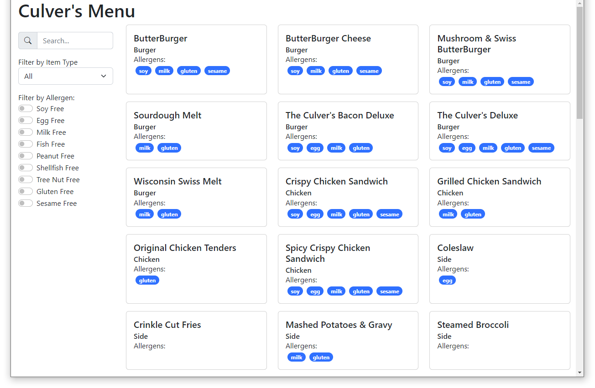
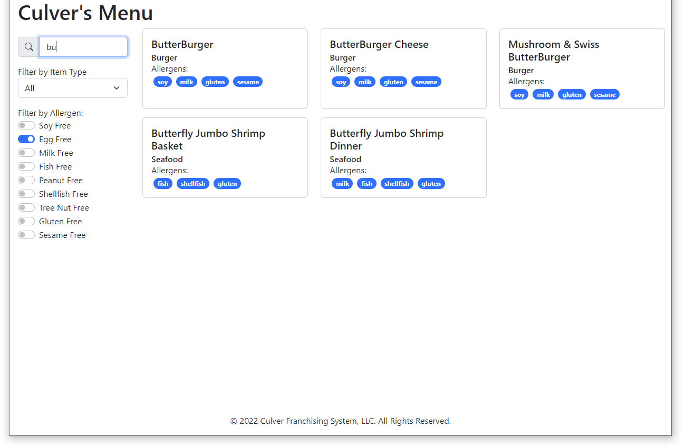

## Introduction

In this assignment, you will create the front-end application in React to display and filter a restaurant menu.

Include source files for all programs in your submission.  Follow good styling for programming questions and provide complete documentation (comment blocks, inline comments for complicated code, etc.).

Work on the assignment is to be done ***individually***.  You are welcome to collaborate with class members, but the project must be your own work.

## Background and References

Food allergies can be a serious problem for restaurant goers.  The [US Food and Drug Administration](https://www.fda.gov/food/food-labeling-nutrition/food-allergies) has identified the "Major 9" most serious food allergies as milk, eggs, fish, shellfish, tree nuts, peanuts, wheat (gluten), soybean, and sesame.

The following are some helpful resources:

- React Documentation: [https://reactjs.org/docs/getting-started.html](https://reactjs.org/docs/getting-started.html)
- Vite Documentation: [https://vitejs.dev/guide/](https://vitejs.dev/guide/)
- Boostrap Documentation: [https://getbootstrap.com/docs/5.3/getting-started/introduction/](https://getbootstrap.com/docs/5.2/getting-started/introduction/)
- Boostrap Icons Documentation: [https://icons.getbootstrap.com/](https://icons.getbootstrap.com/)

## Project Description

For this assignment, your job is to create a front-end web interface using the ReactJS framework that will allow a user to filter a restaurant food menu based on a set of criteria including food allergens.

***NOTE:*** You will not be creating any web server using Node.js.  Your entire implementation will be front-end code.  Your application will be bundled using Vite which provides its own web server for hosting your application.

The menu filter web application allows a user to filter a restaurant menu based on several criteria.  Your user interface must provide a means for the user to filter based on the following:

- Name - Text search of the menu item names
- Type - Selection (drop down) to filter menu items based on type (salad, side, dessert, etc.)
- Allergen - Filter toggles to 'turn off' the display of certain foods based on the allergens they contain.

You are given a list of menu items with names, types, and set of allergens from the Culver's food menu.

- The page must contain a header, footer, filter interface, and search results
- The filter interface must be a separate "sidebar" from the search results.
- The results themselves must be displayed in a grid
  - You are free to use any grid mechanism you like.  For example:
    - Grid CSS Layout - [https://developer.mozilla.org/en-US/docs/Web/CSS/CSS_grid_layout](https://developer.mozilla.org/en-US/docs/Web/CSS/CSS_grid_layout)
    - Bootstrap Grid - [https://getbootstrap.com/docs/5.3/layout/grid/](https://getbootstrap.com/docs/5.3/layout/grid/)
    - Other exist on the web, and you are welcome to use them, just cite your sources
- Each menu item must be displayed using a card.
  - You are free to use any card mechanism you like.  For example:
    - Bootstrap Cards - [https://getbootstrap.com/docs/5.3/components/card/](https://getbootstrap.com/docs/5.3/components/card/).
    - Semantic UI Cards - [https://semantic-ui.com/views/card.html](https://semantic-ui.com/views/card.html)
    - The card must display the menu item name, type, and a list of allergens contained in the menu item

Here is an example of an acceptable interface.  Yours does not need to match this exactly, but must contain the necessary elements.  Be creative, adjust the card formatting in a way that looks best to you.

In case you are curious, this example uses the following Bootstrap components:

- Card grid to force 3 cards per row: [https://getbootstrap.com/docs/5.3/components/card/#grid-cards](https://getbootstrap.com/docs/5.3/components/card/#grid-cards)
- Form input group for the search bar: [https://getbootstrap.com/docs/5.3/forms/input-group](https://getbootstrap.com/docs/5.3/forms/input-group)
- Bootstrap icon for search - requires inclusion of the Bootstrap icons CDN - provided in the given HTML file
- Badge Pills for allergens - [https://getbootstrap.com/docs/5.3/components/badge/#pill-badges](https://getbootstrap.com/docs/5.3/components/badge/#pill-badges)
- Select to filter by item type - [https://getbootstrap.com/docs/5.3/forms/select](https://getbootstrap.com/docs/5.3/forms/select)
- Checkbox switches for allergen filtering - [https://getbootstrap.com/docs/5.3/forms/checks-radios/#switches](https://getbootstrap.com/docs/5.3/forms/checks-radios/#switches)



When the user specifies some type of filter (search, type select, or allergen select) the interface displaying menu items must be updated immediately.  Do ***NOT*** use a submit/update button.



Notice that when the menu is filtered the footer stays at the bottom of the screen.  This can be done using the ["holy grail" layout](src/layout.css).

### Development Requirements

At a minimum, you must implement the following React components:

- **App** - main application component - this will be rendered by the index.js file and will be passed the menu items as a property (through props)
- **FilterBar** - component that contains the filter interface<br/>
  The FilterBar must use contained components for filtering by each category:
    - **SearchBar** - component for searching by name - must use a text input field
    - **TypeSelect** - component for filter based on food type - must use a selection input
    - **AllergenSelect** - component for filtering based on allergen - must use a set of checkbox inputs (or toggles)
- **MenuGrid** - component for displaying the grid of menu items
    - The grid must display three menu items in each row
    - The menu items themselves must be rendered via a contained component
        - **MenuItem** - component containing a single menu item
- **Header** - component for the page header
- **Footer** - component for the page footer

***NOTE:*** Required React components must be created here in their own JavaScript XML file (e.g. App.jsx, MenuItem.jsx etc.).

***NOTE:*** Required React components should be implemented in a declarative manner through JSX.  Use only props, state, and lifecycle to set values for rendering.  Do ***NOT*** use direct DOM manipulation, refs, context, etc. unless discussed in class.  If you have a question concerning if a React feature is allowed, make sure to ask first.

## Getting Started

Create a WebStorm project for this assignment.  In the project you will need the files included in the repository:

- [index.html](index.html) - HTML file containing imports and application structure.  Do ***NOT*** change this file.
- [src/layout.css](src/layout.css) - CSS for the Holy Grail layout.  Will be useful to set your classes for your sidebars and main content.  You do ***NOT*** need to change this file.
- [src/App.jsx](src/App.jsx) - The React JSX code for the App component
- [src/index.jsx](src/index.jsx) - The React application entry point - renders the App on the root element.  Do ***NOT*** change this file.
- [vite.config.json](vite.config.json) - Vite configuration to use React transpiling presets
- [package.json](package.json) - NPM package file containing dependencies for the project

***NOTE:*** The project requires the use of ```vite``` bundler with React plugin.  A ```package.json``` file is provided for you.  To set up your project run: ```npm install```.

***NOTE:*** Create your new component files inside the ```src``` directory.  When you transpile your code, vite will pick up the components and include the transpiled code in a single output file ```index.js```.

At the top of ***EACH SOURCE FILE*** include a comment block with your name, assignment name, and section number.

Your project (in the ```package.json```) has been set up with several commands that you might find useful.  You can run the commands from a terminal in WebStorm

- ```npm run dev``` - Executes ```vite``` in developer mode.  Runs the ```vite``` bundler to transpile and bundle your application and hosts it using the built in ```vite``` web server.
- ```npm run preview``` - Executes ```vite``` in preview mode.  Runs the ```vite``` bundler to transpile and bundle your application, outputs the built files to the ```dist``` folder, and then hosts the files using the ```vite``` web server.
- ```npm run build``` - Executes ```vite``` build.  Runs the ```vite``` bundler to transpile and bundle your application, then outputs the built files to the ```dist``` folder.  Does not host the files.

For development, use ```npm run dev```, then access the web application from the URL printed in the terminal.  The ```vite``` bundler will pick up changes to any saved file and rebuild your application automatically.

## Hints and Tips

- You will be creating multiple JSX source files for this lab.  However, once transpiled by babel, they will all be merged into a single 'index.js' file.  Do ***NOT*** include the JSX files in index.html.
- Since Bootstrap is imported in the ```index.jsx``` file, all Bootstrap classes can be used directly in your component's ```className``` properties.  There is no need to include Bootstrap in your ```index.html```.
- Action handlers from parent components can be passed to children.  For this assignment, this can be useful for the App to be notified when a user changes one of the filters.  For example:

  ```javascript
  const App = () => {
    
      const onTextChange = (newText) => {
          // Process changed text
      }
  
      return <TextInput onChange={onTextChange} />;
  }
  
  const TextInput = (props) => {
      return (
          <input
              type="text"
              onChange={(event) => {
                  props.onChange(event.target.value);
              }}
          />
      );
  }
  ```
- Do ***NOT*** forget to export your React components from your JSX files.

### Frequently Asked Questions

- Question: Can I use a different bundler?
  - Answer: No, for this assignment, you ***must*** use ```vite```
- Question: Can I create additional React components other than what's required?
  - Answer: Yes, absolutely.  Feel free to create as many additional components as you feel are necessary.
- Question: Can I use a framework other than React or write the functionality in "Pure" JavaScript?
  - Answer: No, this lab requires the use of React and React components for functionality.
- Question: Do I have to follow the styling in the example?
  - Answer: No, provided you have the minimal components for the web application and you include all the required elements.  You are required to use a Bootstrap Card for items in the menu grid, however, feel free to
    - Move the filter bar around (e.g. put it in the header)
    - Adjust the menu grid
    - Use different styling for the allergens
    - etc.

## Deliverables

When you are ready to submit your assignment prepare your repository:

- Make sure your name, assignment name, and section number are in comments on ALL HTML, CSS, and JS file(s).
- Make sure your assignment code is commented thoroughly.
- Include in your submission, a set of suggestions for improvement and/or what you enjoyed about this assignment.
- Make sure all files are committed and pushed to the main branch of your repository.

***NOTE***: Do not forget to 'add', 'commit', and 'push' all new files and changes to your repository before submitting.

### Additional Submission Notes

If/when using resources from material outside what was presented in class (e.g., Google search, Stack Overflow, etc.) document the resource used in your submission.  Include exact URLs for web pages where appropriate.

NOTE: Sources that are not original research and/or unreliable sources are not to be used.  For example:

- Wikipedia is not a reliable source, nor does it present original research: [https://en.wikipedia.org/wiki/Wikipedia:Wikipedia_is_not_a_reliable_source](https://en.wikipedia.org/wiki/Wikipedia:Wikipedia_is_not_a_reliable_source)
- ChatGPT is not a reliable source: [https://thecodebytes.com/is-chatgpt-reliable-heres-why-its-not/](https://thecodebytes.com/is-chatgpt-reliable-heres-why-its-not/)

For more information, please see the [MSOE CS Code of Conduct](https://msoe.s3.amazonaws.com/files/resources/swecsc-computing-code-of-conduct.pdf).

To submit, copy the URL for your repository and submit the link to Canvas.

## Grading Criteria

- (5 Points) Submitted files follow submission guidelines
  - Only the requested files were submitted
  - Files are contain name, assignment, section
  - Sources outside of course material are cited
- (5 Points) Suggestions
  - List of suggestions for improvement and/or what you enjoyed about this assignment
- (10 Points) Code Structure
  - Readable code/file structure
  - Code is well documented
  - Code passes the HTML validator without errors
  - Code passes the CSS validator without errors
  - HTML only contains structure - no logic code or styling
- (20 Points) React Components
  - Implementation of required React Components
  - Components are implemented in JSX
  - Components use props and state appropriately - no global variables
- (15 Points) Functionality - Search
  - Search functionality behaves correctly:
  - Case-insensitive substring search
- (15 Points) Functionality - Type Select
  - Behavior of the select by type drop down
  - Correctly filters the menu
- (15 Points) Functionality - Allergen Filter
  - Switches/Checkboxes for filtering by allergens works correctly
- (15 Points) Update Behavior and Formatting
  - Menu items are updated in real-time as modifications are made to the menu filters.
  - Use of a grid and cards for items in the menu
  - All other DOM elements are formatted using custom formatting or a formatting library.
