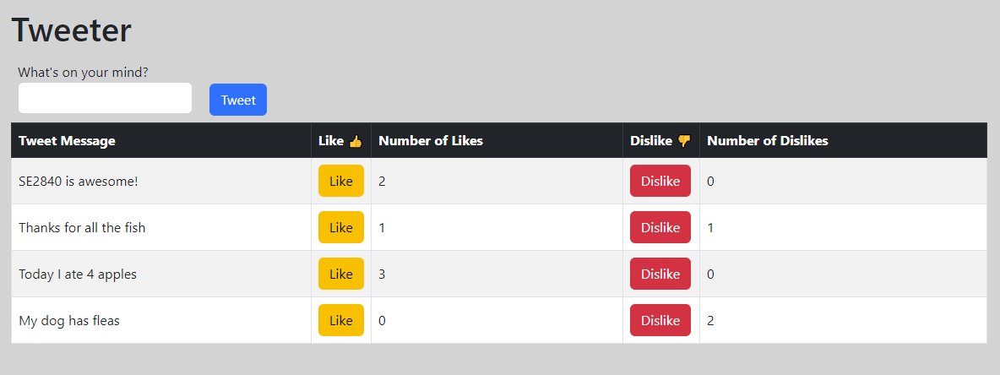

## Introduction

The purpose of this assignment is for you to practice with local storage and scripting attacks.

For this assignment, will be asked to answer questions and/or write some code.  Provide complete answers to all written questions:  When asked for examples, be specific.  Submit your answers in a document separate from code.

Work on the assignment is to be done with ***your assigned group***.  You are welcome to collaborate with class members, but the submitted assignment must be the work of only your group.

## Background and References

### Cross Site Scripting (XSS)

Security of user data and a web applications assets is important especially as more and more applications are moved to the web.  Browsers are adding additional features that web applications can take advantage of while attackers are coming up with new ways to exploit those features be malicious to users.

One such attack is where attackers add their own JavaScript to a web application without the application developer's knowledge.  This attack is called a cross site scripting attack or sometimes a script injection attack.

### Local Storage

It is a security concern to allow a web application access to the user's local hard drive.  Doing so could allow a malicious web application the ability to search a user's hard drive for sensitive data (passwords, credit card numbers, etc.).  However, there may be times when a web application would like to save data on the user's behalf.  For example, user preferences for how the web application should behave.

To allow a web application the ability to save data on the user's computer, the browser object model (BOM) has a feature called LocalStorage - [https://developer.mozilla.org/en-US/docs/Web/API/Window/localStorage](https://developer.mozilla.org/en-US/docs/Web/API/Window/localStorage)

## Security Research

- Research cross site scripting attacks.  Describe cross site scripting in your own words.
- Attack mechanisms are sometimes called "vectors".  From your research, what are two (2) different vectors that attackers use to inject JavaScript in a web application?
- What strategies can a web application developer use to prevent these attacks?

Write your answers in a document (text file is fine) and include this file in your submission.

## Local Storage Research

There are several different mechanism for using storage provided by the browser object model (BOM).

- Research the following storage mechanisms
  - Local Storage
  - Session Storage
- For ***EACH*** mechanism - Describe it in your own words.
- Why are there two different mechanisms?  Give a specific example of why you'd use one vs the other.

Write your answers in a document (text file is fine) and include this file in your submission.

## MSOE Tweeter

For this section, your task is to create a web page to allow a user to record short messages (a.k.a. tweets) as well as allow others to either like or dislike your message.

- A message (tweet) consists of a text message that is at least 1 character long, but no longer than 25 characters (including white space)
- Once recorded the message should be displayed in a table that includes buttons to allow someone to like or dislike the message
- The number of likes and dislikes should be recorded for each message in the table
- The message should only be recorded if it is valid (i.e. has a length greater than 0 and less than 26 characters).

Here is a picture of what the Tweeter web application should look like:



Your job is to create the HTML, CSS, and JavaScript for the tweeter web application.

### Development Requirements

#### Tweet a message

When the user clicks on the "Tweet" button, the web application should:

- Retrieve the text for the message input field
- Validate the text for the message
  - The message must be a string with length > 0 and length <= 25.  Any character (letter, number, symbol, white space, etc.) is a valid character.
  - The message must be different from any previous recorded message.
- If the message text is not valid (e.g. the text is blank or too long or recorded previously) and the user clicks the "Tweet" button then display an error message at the bottom of the screen (below the table) and do not add anything to the table.  Make the error message in red text, so it stands out.

Hide the error message when the user enters a valid message.

The user should ***NOT*** be able to inject JavaScript into your web application with the text they type the input field.

#### Like and Dislike

When a user creates a valid message, it is added to the table.  Two buttons should also be added to their corresponding columns; one for "Like" and one for "Dislike".  In addition to the buttons the number of "likes" and "dislikes" should be displayed in the columns next to the buttons.  When a message is first created, the count of "likes" and "dislikes" should both be 0.

- When a user clicks on the "like" button, the current count of "likes" should be incremented by one and displayed in the table.
- When a user clicks on the "dislike" button, the current count of "dislikes" should be incremented by one and displayed in the table.

#### Local Storage

With every change to the tweet message table (i.e. adding a message, "liking" a message, and "disliking" a message), the contents of the table should be saved to local storage.  The table should then be restored from local storage each time the page is loaded or reloaded.

***NOTE:*** "Like" and "Dislike" functionality should work as described after restoring from local storage.

***NOTE:*** The web application must protect against script injection when the table is restored from local storage.

#### Formatting

The web application should be styled to your liking.  Feel free to use a styling library or utilize your own custom styling.  The following are the minimum requirements for formatting:

- Text input, all buttons, and the table header should be styled other than the browser default
- The table rows should remain striped every other row
- The table columns for the "like" and "dislike" should be as skinny as possible without causing the data to wrap
- The table heading for like and dislike ***must*** include the thumbs up and thumbs down character
  - Perform some research on how to find these characters - cite your sources

### Getting Started

The following files have been provided for you in your repository:

- [tweeter.html](tweeter.html) - HTML structure for your Tweeter
- [tweeter.css](tweeter.css) - CSS for formatting your Tweeter
- [tweeter.js](tweeters.js) - JavaScript for Tweeter logic

They contain imports and a start to the CSS.  You are free to modify this code in any way you feel necessary in order to make your submission fit the behavior.  Feel free to add additional files as necessary.

At the top of ***EACH SOURCE FILE*** include a comment block with your name, assignment name, and section number.

## Hints and Tips

Shrinking and growing a table column can be tricky.  One strategy is to use the width property.  This property tells the web browser how wide to make a DOM element.  The browser will do it's best to honor the width property if it can, however that is not always the case.  For example, if every table column of a 5 column table is set to a width of 40%, the total doesn't add up.

A strategy to shrink a column is to set the width CSS property of the column to something very small (e.g. ```0.1%```).  However, the browser will "scrunch" the table column to be that width.  To prevent the browser from doing that, the ```white-space: nowrap``` property can be set to force the browser to not "scrunch" content.

## Testing and Debugging

- Be sure to test all "edge cases"
  - Blank input
  - Input that is too long
  - Input that contains special characters
- Be sure to test different cross site scripting attack vectors
  - Adding DOM elements through HTML in the text field
  - Direct script tags
  - Calling functions through event handlers set on HTML elements
  - Indirect scripting using errors

## Deliverables

When you are ready to submit your assignment prepare your repository:

- Make sure your name, assignment name, and section number are in comments on ALL HTML, CSS, and JS file(s).
- Make sure you have completed all activities.
- Make sure you cite your sources for all research.
- Make sure your assignment code is commented thoroughly.
- Include in your submission, a set of suggestions for improvement and/or what you enjoyed about this assignment.
- Make sure all files are committed and pushed to the main branch of your repository.

***NOTE***: Do not forget to 'add', 'commit', and 'push' all new files and changes to your repository before submitting.

### Additional Submission Notes

If/when using resources from material outside what was presented in class (e.g., Google search, Stack Overflow, etc.) document the resource used in your submission.  Include exact URLs for web pages where appropriate.

NOTE: Sources that are not original research and/or unreliable sources are not to be used.  For example:

- Wikipedia is not a reliable source, nor does it present original research: [https://en.wikipedia.org/wiki/Wikipedia:Wikipedia_is_not_a_reliable_source](https://en.wikipedia.org/wiki/Wikipedia:Wikipedia_is_not_a_reliable_source)
- ChatGPT is not a reliable source: [https://thecodebytes.com/is-chatgpt-reliable-heres-why-its-not/](https://thecodebytes.com/is-chatgpt-reliable-heres-why-its-not/)

For more information, please see the [MSOE CS Code of Conduct](https://msoe.s3.amazonaws.com/files/resources/swecsc-computing-code-of-conduct.pdf).

To submit, copy the URL for your repository and submit the link to Canvas.

## Grading Criteria

- (5 Points) Submitted files follow submission guidelines
  - Only the requested files were submitted
  - Files are contain name, assignment, section
  - Sources outside of course material are cited
- (5 Points) Suggestions
  - List of suggestions for improvement and/or what you enjoyed about this assignment
- (10 Points) Code Structure
  - Readable code/file structure
  - Code is well documented
  - Code passes the HTML validator without errors
  - Code passes the CSS validator without errors
  - HTML only contains structure - no logic code or styling
- (10 Points) Security Research
- (10 Points) Local Storage Research
- (10 Points) "Tweet" Functionality
  - Message with buttons are correctly added to the table
  - "Likes" and "Dislikes" are correctly initialized
- (10 Points) "Like" and "Dislike" Functionality
  - Values for "likes" and "dislikes" are incremented when the corresponding button is clicked
  - Values for "likes" and "dislikes" are set only for the corresponding message
- (10 Points) Correct validation of user input
  - Message text must be a string of length > 0 and length < 26 characters
  - Correct behavior of the "empty input" error message
- (5 Points) Formatting
  - Correct formatting as described
- (10 Points) Script Injection
  - Correct prevention of script injection attacks
- (15 Points) Local Storage
  - Messages, "likes", and "dislikes" are stored in local storage and successfully restored when the page is refreshed
  - The "like" and "dislike" buttons function correctly after restoring from local storage